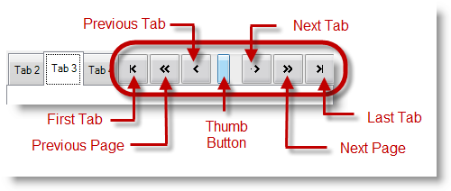

////

|metadata|
{
    "name": "touch-enabled-tab-controls",
    "controlName": [],
    "tags": [],
    "guid": "c7d50c63-c7bb-4d2b-aa2d-208fad8fab23",  
    "buildFlags": [],
    "createdOn": "2013-01-10T21:52:21.6356904Z"
}
|metadata|
////

= Touch-enabled Tab Controls

== Topic Overview

=== Purpose

This topic illustrates the Infragistics touch-enabled Tab controls and components, which include link:{ApiPlatform}win.ultrawintabcontrol{ApiVersion}~infragistics.win.ultrawintabcontrol.ultratab_members.html[WinTab]™ and link:{ApiPlatform}win.ultrawintabcontrol{ApiVersion}~infragistics.win.ultrawintabcontrol.ultratabstripcontrol_members.html[WinTabStrip]™ controls, and link:{ApiPlatform}win.ultrawintabbedmdi{ApiVersion}~infragistics.win.ultrawintabbedmdi.ultratabbedmdimanager_members.html[WinTabbedMdiManager]™ component.

=== In this topic

This topic contains the following sections:

* <<_Ref344307846,Touchable  _WinTab_   and  _WinTabStrip_   Control Elements>>

** <<_Ref342757493,Overview>>
** <<_Ref344307859,Tab elements>>
** <<_Ref344307867,Scroll buttons>>
** <<_Ref344308300,Close buttons>>
** <<_Ref344307892,NotePage element>>
** <<_Ref344731499,Tab list button>>

* <<_Ref344731514,Touchable  _WinTabbedMdiManager_   Component Elements>>

** <<_Ref344731523,Overview>>
** <<_Ref344731534,Tab elements>>
** <<_Ref344731544,Scroll buttons>>
** <<_Ref344731554,Close buttons>>
** <<_Ref344320711,Splitter element>>
** <<_Ref344320719,Tab list button>>

* <<_Ref342757647,Related Content>>

[[_Ref342757484]]
[[_Ref344307846]]
== Touchable  _WinTab_   and  _WinTabStrip_   Control Elements

[[_Ref342757493]]

=== Overview

The following sections illustrate the touchable  _WinTab and WinTabStrip_   controls. The touchable elements in both WinTab and WinTabStrip controls are the same, so the screenshots apply to both controls.

[[_Ref344307859]]

=== Tab elements

[[_Ref344307867]]

=== Scroll buttons

Use the control’s `ScrollButtonTypes` property to display the scroll buttons. By default, the Previous Tab and Next Tab buttons will appear when you add more tabs than fit in the viewable area.

*In C#:*

[source,csharp]
----
ultraTabControl1.ScrollButtonTypes = Infragistics.Win.UltraWinTabs.ScrollButtonTypes.FirstLast;
----

*In Visual Basic:*

[source,vb]
----
ultraTabControl1.ScrollButtonTypes = Infragistics.Win.UltraWinTabs.ScrollButtonTypes.FirstLast
----

[[_Ref344307876]]

=== Close buttons

Close button (In tab) closes only the tab it resides on.

Close button (In tab header area) closes the active tab.

[[_Ref344307892]]

=== NotePage element

The  _NotePage_   and  _NotePageFlat_   are tab control styles that are touchable elements providing page forward and page backward functionality.

[[_Ref344307899]]

=== Tab list button

The items in the list are touchable as well as the button that drops down the list of items.

[[_Ref344731514]]
== Touchable  _WinTabbedMdiManager_   Component Elements

[[_Ref344731523]]

=== Overview

The following sections illustrate the  _WinTabbedMdiManager_   component’s touchable elements.

[[_Ref344731534]]

=== Tab elements

image::images/Touch_Tab_Controls_and_Components_7.png[]

[[_Ref344731544]]

=== Scroll buttons

Use the control’s `ScrollButtonTypes` property to display the scroll buttons. By default, the Previous Tab and Next Tab buttons will appear when you add more tabs than fit in the viewable area.

*In C#:*

[source,csharp]
----
ultraTabbedMdiManager1.TabGroupSettings.ScrollButtonTypes =
Infragistics.Win.UltraWinTabs.ScrollButtonTypes.FirstLast;
----

*In Visual Basic:*

[source,vb]
----
ultraTabbedMdiManager1.TabGroupSettings.ScrollButtonTypes = Infragistics.Win.UltraWinTabs.ScrollButtonTypes.FirstLast
----

[[_Ref344731554]]

=== Close buttons

Close button (In tab) closes only the tab it resides on.

Close button (In tab header area) closes the active tab.

[[_Ref344320711]]

=== Splitter element

[[_Ref344320719]]

=== Tab list button

The items in the list and the drops down button are touchable elements.

[[_Ref342757647]]
== Related Content

=== Topics

The following topics provide additional information related to this topic.

[options="header", cols="a,a"]
|====
|Topic|Purpose

| link:wintouchprovider-overview.html[Touch Support Overview]
|The topic provides conceptual overview of the Infragistics touch-enabled controls and components.

| link:touch-enabled-editor-controls.html[Touch Editor Controls and Elements]
|This topic illustrates the Infragistics touch-enabled editor controls and elements.

| link:touch-enabled-wingrid-control-elements.html[Touch WinGrid Control Elements]
|This topic illustrates the Infragistics touch-enabled _WinGrid_ control elements.

| link:touch-enabled-winlistview-control.html[Touch WinListView Control]
|This topic illustrates the Infragistics touch-enabled _WinListView_ control elements.

| link:touch-enabled-wintree-control.html[Touch WinTree Control]
|This topic illustrates the Infragistics touch-enabled _WinTree_ control elements.

|====