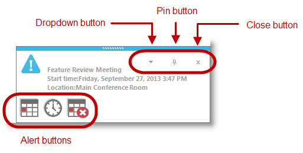

////

|metadata|
{
    "name": "touch-enabled-windesktopalert",
    "controlName": [],
    "tags": [],
    "guid": "9f8f1821-0588-4839-835f-4b2d5c3e8bc1",  
    "buildFlags": [],
    "createdOn": "2013-09-15T23:54:34.2453419Z"
}
|metadata|
////

= Touch-enabled WinDesktopAlert

== Topic Overview

=== Purpose

This topic illustrates the Infragistics touch-enabled link:{ApiPlatform}win.misc{ApiVersion}~infragistics.win.misc.ultradesktopalert_members.html[WinDesktopAlert]™ control elements.

== Touchable  _WinDesktopAlert_   Elements

=== Touchable element

Outlined in the following screenshot are the  _WinDesktopAlert_   control’s touchable elements. In touch-enabled mode the touch elements appear slightly larger.

.Note:
[NOTE]
====
The state of the touch-enabled setting of the link:{ApiPlatform}win{ApiVersion}~infragistics.win.touch.ultratouchprovider_members.html[UltraTouchProvider] is cached and used for the duration of the alert window. Toggling the `Enabled` property of the link:{ApiPlatform}win{ApiVersion}~infragistics.win.touch.ultratouchprovider_members.html[UltraTouchProvider] will have no impact on already open alert windows.
====

== Related Content

=== Topics

The following topics provide additional information related to this topic.

[options="header", cols="a,a"]
|====
|Topic|Purpose

| link:wintouchprovider.html[Touch Support]
|This section contains links to specific topics explaining the feature for developing touch-enabled applications using the Infragistics controls and components.

| link:touch-gestures.html[Touch Gestures]
|The topics in this group illustrate Infragistics touch-enabled control’s Touch Gestures.

| link:windesktopalert.html[WinDesktopAlert]
|This section contains valuable information about _WinDesktopAlert_™, ranging from what the component does and why you would want to use it in your application, to step-by-step procedures on how to accomplish a common task using the component.

|====