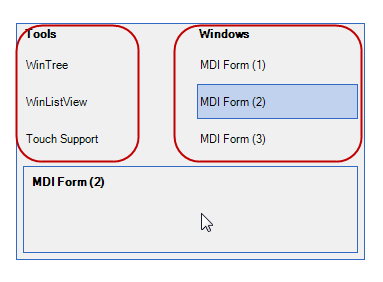

////

|metadata|
{
    "name": "touch-enabled-windockmanager",
    "controlName": [],
    "tags": [],
    "guid": "db2fa778-69eb-428f-903a-07f3c0d64269",  
    "buildFlags": [],
    "createdOn": "2013-09-15T23:55:25.4004569Z"
}
|metadata|
////

= Touch-enabled WinDockManager

== Topic Overview

=== Purpose

This topic illustrates the Infragistics touch-enabled link:{ApiPlatform}win.ultrawindock{ApiVersion}~infragistics.win.ultrawindock.ultradockmanager_members.html[WinDockManager]™ control elements.

== Touchable  _WinDockManager_   Elements and Gestures

=== Touchable element

Rendered slightly larger in touch-enabled mode, the following screenshots illustrate the  _WinDockManager_   control’s touchable elements.

[options="header", cols="a,a"]
|====
|Element name|Image

|PaneCaptionButtons
|image::images/Touch_WinDockManager_1.png[]

|Tab
|image::images/Touch_WinDockManager_2.png[]

|Tab (collapsed view)
|image::images/Touch_WinDockManager_3.png[]

|Pane caption menu
|image::images/Touch_WinDockManager_4.png[]

|Navigator items
|The navigator dialog displays when you use _UltraDockManager_ on an MDI parent form. Press and hold `Ctrl+Tab` to display the dialog. 

|WindowDockingAreaSplitter
|image::images/Touch_WinDockManager_6.png[]

|====

== Related Content

=== Topics

The following topics provide additional information related to this topic.

[options="header", cols="a,a"]
|====
|Topic|Purpose

| link:wintouchprovider.html[Touch Support]
|This section contains links to specific topics explaining the feature for developing touch-enabled applications using the Infragistics controls and components.

| link:touch-gestures.html[Touch Gestures]
|The topics in this group illustrate Infragistics touch-enabled control’s Touch Gestures.

| link:windockmanager.html[WinDockManager]
|This section contains valuable information about _WinDockManager_, ranging from what the component does and why you would want to use it in your application, to step-by-step procedures on how to accomplish a common task using the component.

|====