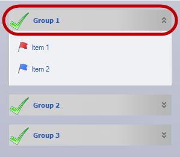
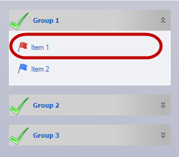
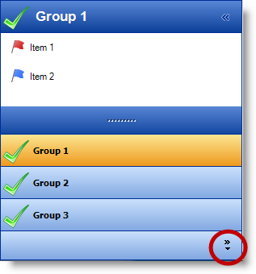
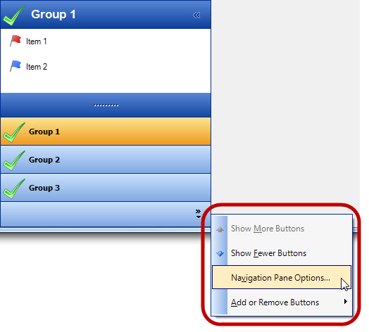
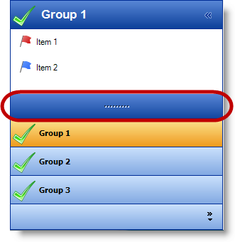
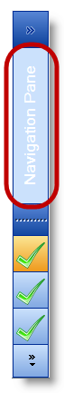

////

|metadata|
{
    "name": "touch-enabled-winexplorerbar",
    "controlName": [],
    "tags": [],
    "guid": "abd70838-3ed0-4e28-b8b4-1de39fcb60db",  
    "buildFlags": [],
    "createdOn": "2013-09-15T23:56:18.1817345Z"
}
|metadata|
////

= Touch-enabled WinExplorerBar

== Topic Overview

=== Purpose

This topic illustrates the Infragistics touch-enabled link:{ApiPlatform}win.ultrawinexplorerbar{ApiVersion}~infragistics.win.ultrawinexplorerbar.ultraexplorerbar_members.html[WinExplorerBar]™ control elements.

== Touchable  _WinExplorerBar_   Elements

=== Touchable element

Appearing slightly larger in touch-enabled mode, the following screenshots illustrate the  _WinExplorerBar_   control’s touchable elements. The control provides the following list of style options. Some of the elements visually appear in all styles, while others only appear in some of them.

Available style are:

* `ExplorerBar`
* `ListBar`
* `OutlookNavigationPane`
* `Toolbox`
* `VisualStudio2005Toolbox`

[options="header", cols="a,a"]
|====
|Element name|Image

|UltraExplorerBarGroupHeader
|This element visually appears in all styles. 

|Item
|This element appears in all styles. 

|Navigation Overflow QuickCustomizeButton
|This element only appears in `OulookNavigationPane` style. 

|NavigationOverflowQuickCustomize menu
|This element only appears in `OulookNavigationPane` style. 

|NavigationSplitterBar
|This element only appears in `OulookNavigationPane` style. 

|NavigationPaneExpansionButton
|This element appears in expanded and collapsed views of the `OulookNavigationPane`.

|
|image::images/Touch_WinExplorerBar_6.png[]

|NavigationPaneCollapsedGroupArea
|This element only appears in collapsed view of the `OulookNavigationPane`. 

|====

== Related Content

=== Topics

The following topics provide additional information related to this topic.

[options="header", cols="a,a"]
|====
|Topic|Purpose

| link:wintouchprovider.html[Touch Support]
|This section contains links to specific topics explaining the feature for developing touch-enabled applications using the Infragistics controls and components.

| link:touch-gestures.html[Touch Gestures]
|The topics in this group illustrate Infragistics touch-enabled control’s Touch Gestures.

|====