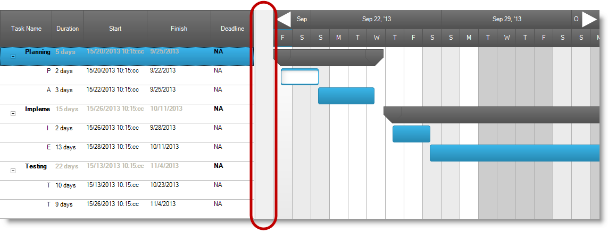
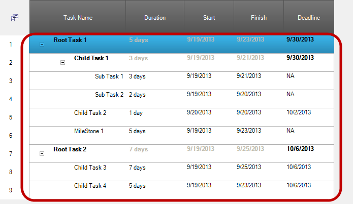
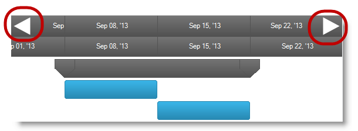
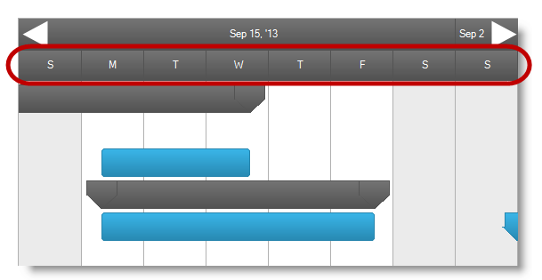
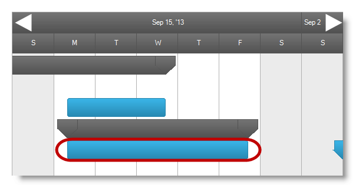
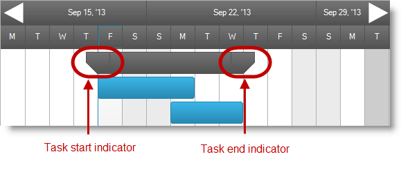
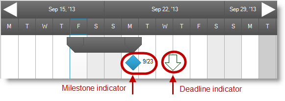
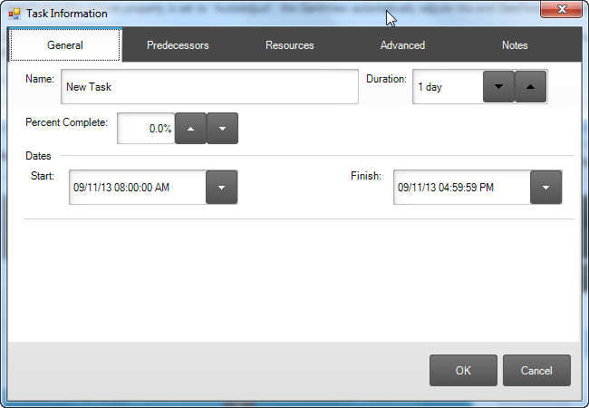

////

|metadata|
{
    "name": "touch-enabled-winganttview",
    "controlName": [],
    "tags": [],
    "guid": "af764b66-46d4-4283-b9d0-8b3ea30f040e",  
    "buildFlags": [],
    "createdOn": "2013-09-15T23:56:57.2656425Z"
}
|metadata|
////

= Touch-enabled WinGanttView

== Topic Overview

=== Purpose

This topic illustrates the Infragistics touch-enabled link:{ApiPlatform}win.ultrawinganttview{ApiVersion}~infragistics.win.ultrawinganttview.ultraganttview_members.html[WinGanttView]™ control elements.

== Touchable  _WinGanttView_   Elements and Gestures

=== Touchable element

The following screenshot outlines the  _WinGanttView_   control’s touchable elements. The touch elements appear slightly larger in touch-enabled mode.

==== VerticalSplitter Element

The splitter allows dragging if, and only if, both Grid and Timeline sections are visible.

==== Row Element

==== DateNavigationButton Element

==== ColumnHeader Element

==== TaskBar Element

Allows task bar dragging, but not panning, when interacting with the task bar.

==== Task Start and End indicators

* Task Start indicator element indicates the task's begin date.
* Task End indicator element indicates the task's end date.

==== Task Milestone and Deadline indicators

Task Milestone element indicates the task deliverable.

Task Deadline element indicates the date for the task to be completed.

.Note:
[NOTE]
====
Task information dialog also supports touch. The enlarged rendering of these elements is for easier user interaction.
====

=== Gesture Support

Gesture support for the  _WinGanttView_   control consists of vertical and horizontal panning along with flicking (See link:touch-gestures.html[Touch Gestures] for more details).

== Related Content

=== Topics

The following topics provide additional information related to this topic.

[options="header", cols="a,a"]
|====
|Topic|Purpose

| link:wintouchprovider.html[Touch Support]
|This section contains links to specific topics explaining the feature for developing touch-enabled applications using the Infragistics controls and components.

| link:touch-gestures.html[Touch Gestures]
|The topics in this group illustrate Infragistics touch-enabled control’s Touch Gestures.

|====