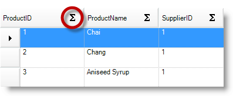

////

|metadata|
{
    "name": "touch-enabled-wingrid-control-elements",
    "controlName": [],
    "tags": [],
    "guid": "2b6fcca7-ebb0-4fd1-8741-84285169d6c5",  
    "buildFlags": [],
    "createdOn": "2013-01-09T15:01:47.5313953Z"
}
|metadata|
////

= Touch-enabled WinGrid Control Elements

== Topic Overview

=== Purpose

This topic illustrates the Infragistics touch-enabled link:{ApiPlatform}win.ultrawingrid{ApiVersion}~infragistics.win.ultrawingrid.ultragrid_members.html[WinGrid]™ control elements.

=== In this topic

This topic contains the following sections:

* <<_Ref342757484,WinGrid Touchable Elements>>

** <<_Ref342757493,Overview>>
** <<_Ref342944043,Card expansion indicator>>
** <<_Ref342944051,Column chooser button>>
** <<_Ref342944062,Column Header check box>>
** <<_Ref342944071,Filter clear button>>
** <<_Ref342944079,Filter drop-down button>>
** <<_Ref342944088,Filter operator>>
** <<_Ref342944098,Fixed header indicator>>
** <<_Ref342944108,Fixed row indicator>>
** <<_Ref342944118,Row expansion indicator>>
** <<_Ref342944127,Row selector edit template>>
** <<_Ref342944136,Row selector>>
** <<_Ref342944145,Row summary button>>
** <<_Ref342944156,Swap button>>

* <<_Ref342757647,Related Content>>

[[_Ref342757484]]
== WinGrid Touchable Elements

[[_Ref342757493]]

=== Overview

The following sections illustrate the  _WinGrid_  ’s touchable elements and provide code examples demonstrating how to enable them.

[[_Ref342944043]]

=== Card expansion indicator

Card expansion indicator will display when a `Band` is in `CardView` mode with the `CardSettings.Style` set to  _Compressed_   style.

*In C#:*

[source,csharp]
----
ultraGrid1.DisplayLayout.Bands[0].CardView = true;
ultraGrid1.DisplayLayout.Bands[0].CardSettings.Style = CardStyle.Compressed;
----

*In Visual Basic:*

[source,vb]
----
ultraGrid1.DisplayLayout.Bands(0).CardView = True
ultraGrid1.DisplayLayout.Bands(0).CardSettings.Style = CardStyle.Compressed
----

[[_Ref342944051]]

=== Column chooser button

Set the `Override.RowSelectorHeaderStyle` =  _ColumnChooserButton_   or  _ColumnChooserButtonFixedSize_   to enable the column chooser button, displayed above the row selectors.

.Note:
[NOTE]
====
You must first enable the <<_Ref342944136,Row selector>> for the column choosers to appear.
====

*In C#:*

[source,csharp]
----
ultraGrid1.DisplayLayout.Override.RowSelectorHeaderStyle = RowSelectorHeaderStyle.ColumnChooserButton;
----

*In Visual Basic:*

[source,vb]
----
ultraGrid1.DisplayLayout.Override.RowSelectorHeaderStyle = RowSelectorHeaderStyle.ColumnChooserButton
----

[[_Ref342944062]]

=== Column Header check box

Set the `Override.HeaderCheckBoxVisibility` =  _Always_   or  _WhenUsingCheckEditor_   to enable the check boxes on the column headers.

image::images/Touch_WinGrid_Control_Elements_3.png[]

[[_Ref342944071]]

=== Filter clear button

Set the filter operator on the link:{ApiPlatform}win.ultrawingrid{ApiVersion}~infragistics.win.ultrawingrid.ultragridoverride~rowselectors.html[FilterRow] to enable the filter clear button.

[[_Ref342944079]]

=== Filter drop-down button

The following code demonstrates how to enable the column header’s filter drop-down button.

*In C#:*

[source,csharp]
----
ultraGrid1.DisplayLayout.Override.AllowRowFiltering = DefaultableBoolean.True;
----

*In Visual Basic:*

[source,vb]
----
ultraGrid1.DisplayLayout.Override.AllowRowFiltering = DefaultableBoolean.[True]
----

[[_Ref342944088]]

=== Filter operator

The following code demonstrates how to enable the link:{ApiPlatform}win.ultrawingrid{ApiVersion}~infragistics.win.ultrawingrid.ultragridoverride~rowselectors.html[FilterRow] filter operator.

*In C#:*

[source,csharp]
----
ultraGrid1.DisplayLayout.Override.FilterUIType = FilterUIType.FilterRow;
----

*In Visual Basic:*

[source,vb]
----
ultraGrid1.DisplayLayout.Override.FilterUIType = FilterUIType.FilterRow
----

[[_Ref342944098]]

=== Fixed header indicator

The following code demonstrates how to enable the column headers’ fixed header indicator.

*In C#:*

[source,csharp]
----
ultraGrid1.DisplayLayout.UseFixedHeaders = true;
----

*In Visual Basic:*

[source,vb]
----
ultraGrid1.DisplayLayout.UseFixedHeaders = True
----

[[_Ref342944108]]

=== Fixed row indicator

The following code demonstrates how to enable the fixed row indicator displayed in the row selectors by setting the `Override.FixedRowIndicator` =  _Button_  .

*In C#:*

[source,csharp]
----
ultraGrid1.DisplayLayout.Override.FixedRowIndicator = FixedRowIndicator.Button;
----

*In Visual Basic:*

[source,vb]
----
ultraGrid1.DisplayLayout.Override.FixedRowIndicator = FixedRowIndicator.Button
----

[[_Ref342944118]]

=== Row expansion indicator

The following code demonstrates how to enable the row’s row expansion indicators.

*In C#:*

[source,csharp]
----
ultraGrid1.DisplayLayout.Override.ExpansionIndicator = ShowExpansionIndicator.Always;
----

*In Visual Basic:*

[source,vb]
----
ultraGrid1.DisplayLayout.Override.ExpansionIndicator = ShowExpansionIndicator.Always
----

Compare the before and after touch-enabled screenshots and notice that the expansion indicators are the same size, but the touchable area is larger when Touch is enabled.

==== Before enabling Touch

==== After enabling Touch

[[_Ref342944127]]

=== Row selector edit template

The following code demonstrates how to enable the row selectors in which the row edit template displayed.

*In C#:*

[source,csharp]
----
ultraGrid1.DisplayLayout.Override.RowEditTemplateUIType = RowEditTemplateUIType.RowSelectorImage;
----

*In Visual Basic:*

[source,vb]
----
ultraGrid1.DisplayLayout.Override.RowEditTemplateUIType = RowEditTemplateUIType.RowSelectorImage
----

[[_Ref342944136]]

=== Row selector

The following code demonstrates how to enable the row selector.

*In C#:*

[source,csharp]
----
ultraGrid1.DisplayLayout.Bands[0].Override.RowSelectors = DefaultableBoolean.True;
----

*In Visual Basic:*

[source,vb]
----
ultraGrid1.DisplayLayout.Bands(0).Override.RowSelectors = DefaultableBoolean.[True]
----

[[_Ref342944145]]

=== Row summary button

The following code demonstrates how to enable the row summary buttons displayed on the column headers.

*In C#:*

[source,csharp]
----
ultraGrid1.DisplayLayout.Override.AllowRowSummaries = AllowRowSummaries.True;
----

*In Visual Basic:*

[source,vb]
----
ultraGrid1.DisplayLayout.Override.AllowRowSummaries = AllowRowSummaries.[True]
----

[[_Ref342944156]]

=== Swap button

The following code demonstrates how to enable the column header’s swap button on the column header, thus allowing column swapping within a group or band.

*In C#:*

[source,csharp]
----
ultraGrid1.DisplayLayout.Override.AllowColSwapping = AllowColSwapping.WithinBand;
----

*In Visual Basic:*

[source,vb]
----
ultraGrid1.DisplayLayout.Override.AllowColSwapping = AllowColSwapping.WithinBand
----

[[_Ref342757647]]
== Related Content

=== Topics

The following topics provide additional information related to this topic.

[options="header", cols="a,a"]
|====
|Topic|Purpose

| link:wintouchprovider-overview.html[Touch Support Overview]
|The topic provides conceptual overview about Touch feature of Infragistics touch-enabled controls.

| link:touch-enabled-editor-controls.html[Touch Editor Controls and Elements]
|This topic illustrates the Infragistics touch-enabled editor controls and elements.

| link:touch-enabled-tab-controls.html[Touch Tab Controls and Components]
|This topic illustrates the Infragistics touch-enabled Tab controls and components, which include _WinTab_ and _WinTabStrip_ controls, and _WinTabbedMdiManager_ component.

| link:touch-enabled-winlistview-control.html[Touch WinListView Control]
|This topic illustrates the Infragistics touch-enabled _WinListView_ control elements.

| link:touch-enabled-wintree-control.html[Touch WinTree Control]
|This topic illustrates the Infragistics touch-enabled _WinTree_ control elements.

|====