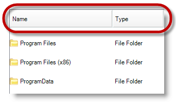
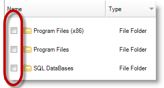
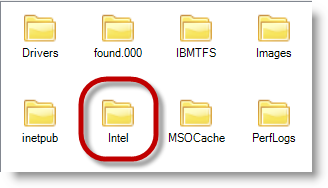
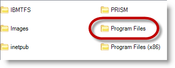
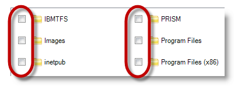
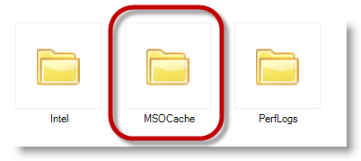
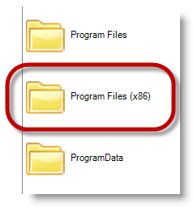

////

|metadata|
{
    "name": "touch-enabled-winlistview-control",
    "controlName": [],
    "tags": [],
    "guid": "3ac3a47b-87f6-4877-9004-2e4a5051b2cd",  
    "buildFlags": [],
    "createdOn": "2013-01-10T21:53:38.0633324Z"
}
|metadata|
////

= Touch-enabled WinListView Control

== Topic Overview

=== Purpose

This topic illustrates the Infragistics touch-enabled link:{ApiPlatform}win.ultrawinlistview{ApiVersion}~infragistics.win.ultrawinlistview.ultralistview_members.html[WinListView]™ control elements.

=== In this topic

This topic contains the following sections:

* <<_Ref344307846,Touchable  _WinListView_   Control Elements>>

** <<_Ref342757493,Overview>>
** <<_Ref344991601,Details view>>
** <<_Ref344991609,Details view with checkboxes>>
** <<_Ref345060108,Icons view>>
** <<_Ref344994817,List view>>
** <<_Ref344994827,List view with checkboxes>>
** <<_Ref344991617,Thumbnails view>>
** <<_Ref345060116,Tiles view>>

* <<_Ref344993258,Related Content>>

[[_Ref342757484]]
[[_Ref344307846]]
== Touchable  _WinListView_   Control Elements

[[_Ref342757493]]

=== Overview

The following sections illustrate the touchable elements, encapsulated in red throughout this topic, in different views of the  _WinListView_   _™_   control.

[[_Ref344991601]]

=== Details view

The  _Details_   view is the only view that displays column headers.

[[_Ref344991609]]

=== Details view with checkboxes

Only the  _Details_   or  _List_   view can enable checkboxes.

*In C#:*

[source,csharp]
----
ultraListView1.View = UltraListViewStyle.Details;
ultraListView1.ViewSettingsDetails.CheckBoxStyle = CheckBoxStyle.CheckBox;
----

*In Visual Basic:*

[source,vb]
----
ultraListView1.View = UltraListViewStyle.Details
ultraListView1.ViewSettingsDetails.CheckBoxStyle = CheckBoxStyle.CheckBox
----

[[_Ref344994809]]

=== Icons view

[[_Ref344994817]]

=== List view

[[_Ref344994827]]

=== List view with checkboxes

Checkboxes can only be enabled with  _Details_   or  _List_   view.

*In C#:*

[source,csharp]
----
ultraListView1.View = UltraListViewStyle.List;
ultraListView1.ViewSettingsList.CheckBoxStyle = CheckBoxStyle.CheckBox;
----

*In Visual Basic:*

[source,vb]
----
ultraListView1.View = UltraListViewStyle.List
ultraListView1.ViewSettingsList.CheckBoxStyle = CheckBoxStyle.CheckBox
----

[[_Ref344991617]]

=== Thumbnails view

[[_Ref345060116]]

=== Tiles view

[[_Ref344993258]]
== Related Content

=== Topics

The following topics provide additional information related to this topic.

[options="header", cols="a,a"]
|====
|Topic|Purpose

| link:wintouchprovider-overview.html[Touch Support Overview]
|The topic provides conceptual overview of the Infragistics touch-enabled controls and components.

| link:touch-enabled-editor-controls.html[Touch Editor Controls and Elements]
|This topic illustrates the Infragistics touch-enabled editor controls and elements.

| link:touch-enabled-wingrid-control-elements.html[Touch WinGrid Control Elements]
|This topic illustrates the Infragistics touch-enabled _WinGrid_ control elements.

| link:touch-enabled-tab-controls.html[Touch Tab Controls and Components]
|This topic illustrates the Infragistics touch-enabled Tab controls and components, which include _WinTab_ and _WinTabStrip_ controls, and _WinTabbedMdiManager_ component.

| link:touch-enabled-wintree-control.html[Touch WinTree Control]
|This topic illustrates the _Infragistics_ touch-enabled _WinTree_ control elements.

|====