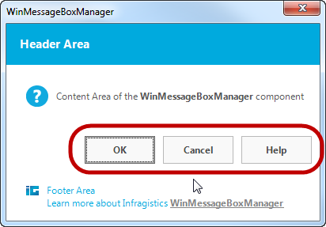

////

|metadata|
{
    "name": "touch-enabled-winmessagebox",
    "controlName": [],
    "tags": [],
    "guid": "e716d39e-7c3c-42a0-89ab-c931e47dafb8",  
    "buildFlags": [],
    "createdOn": "2013-09-15T23:57:31.0000156Z"
}
|metadata|
////

= Touch-enabled WinMessageBox

== Topic Overview

=== Purpose

This topic illustrates the Infragistics touch-enabled link:{ApiPlatform}win{ApiVersion}~infragistics.win.ultramessagebox.messageboxcontrol_members.html[WinMessageBox]™ control elements.

== Touchable  _WinMessageBox_   Elements

=== Touchable element

Appearing slightly larger in touch-enabled mode, the following screenshots illustrate the  _WinMessageBox_   control’s touchable elements.

.Note:
[NOTE]
====
The control caches and uses state of the touch-enabled setting of the link:{ApiPlatform}win{ApiVersion}~infragistics.win.touch.ultratouchprovider_members.html[UltraTouchProvider] for the duration of the message box display. Toggling the `Enabled` property of the link:{ApiPlatform}win{ApiVersion}~infragistics.win.touch.ultratouchprovider_members.html[UltraTouchProvider] has no effect on already open message boxes.
====

== Related Content

=== Topics

The following topics provide additional information related to this topic.

[options="header", cols="a,a"]
|====
|Topic|Purpose

| link:wintouchprovider.html[Touch Support]
|This section contains links to specific topics explaining the feature for developing touch-enabled applications using the Infragistics controls and components.

| link:touch-gestures.html[Touch Gestures]
|The topics in this group illustrate Infragistics touch-enabled control’s Touch Gestures.

|====