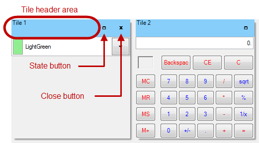

////

|metadata|
{
    "name": "touch-enabled-wintilepanel",
    "controlName": [],
    "tags": [],
    "guid": "75f6b453-3dbc-449f-8827-326a0bf15596",  
    "buildFlags": [],
    "createdOn": "2014-01-29T17:14:23.9253767Z"
}
|metadata|
////

= Touch-enabled WinTilePanel

== Topic Overview

=== Purpose

This topic illustrates Infragistics Touch-Enabled  _Win_  _TilePanel_™ control elements.

== Touchable  _WinTilePanel_   Elements

=== Touchable element

The touch elements appear slightly larger when viewed with Touch mode enabled than with it disabled. The control’s link:{ApiPlatform}win.misc{ApiVersion}~infragistics.win.misc.ultrapanel~getpreferredsize.html[GetPreferredSize] method uses the touch metrics as the minimum size, allowing the control to be either Auto-Sized, or explicitly sized by the application developer as a Touch-Friendly size.

The following touchable elements as illustrated in the screenshot below, are used by the tile for:

*  *Tile header area*  – Dragging-and-Dropping
*  *State button*  – Minimizing and maximizing
*  *Close button*  – Closing or removing from the view

.Note:
[NOTE]
====
In normal view gestures are converted into mouse actions allowing the use of a finger to drag tiles around and to interact with buttons by tapping on them.
====

== Related Content

=== Topics

The following topics provide additional information related to this topic.

[options="header", cols="a,a"]
|====
|Topic|Purpose

| link:wintouchprovider.html[Touch Support]
|This section contains links to specific topics explaining the feature for developing touch-enabled applications using the Infragistics controls and components.

| link:touch-gestures.html[Touch Gestures]
|The topics in this group illustrate Infragistics touch-enabled control’s Touch Gestures.

|====