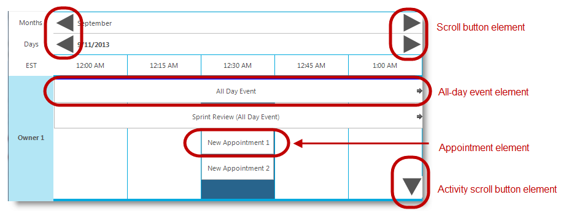

////

|metadata|
{
    "name": "touch-enabled-wintimelineview",
    "controlName": [],
    "tags": [],
    "guid": "b15dc33f-69a4-449b-95bc-f2972b808845",  
    "buildFlags": [],
    "createdOn": "2013-09-15T23:59:06.3955542Z"
}
|metadata|
////

= Touch-enabled WinTimelineView

== Topic Overview

=== Purpose

This topic illustrates the Infragistics touch-enabled link:{ApiPlatform}win.ultrawinschedule{ApiVersion}~infragistics.win.ultrawinschedule.ultratimelineview_members.html[WinTimelineView]™ control elements.

== Touchable  _WinTimelineView_   Elements and Gestures

=== Touchable element

The following screenshot illustrates the  _WinTimelineView_   control’s touchable elements, that when enabled, renders these elements slightly larger facilitating user interaction.

=== Gesture Support

Gesture support for the  _WinTimelineView_   control includes vertical and horizontal panning, flicking, drag-selection of time slot descriptors and appointment dragging (See link:touch-gestures.html[Touch Gestures]).

== Related Content

=== Topics

The following topics provide additional information related to this topic.

[options="header", cols="a,a"]
|====
|Topic|Purpose

| link:wintouchprovider.html[Touch Support]
|This section contains links to specific topics explaining the feature for developing touch-enabled applications using the Infragistics controls and components.

| link:touch-gestures.html[Touch Gestures]
|The topics in this group illustrate Infragistics touch-enabled control’s Touch Gestures.

|====