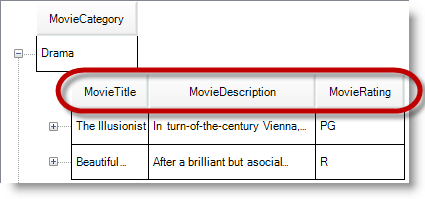
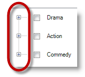
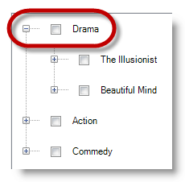
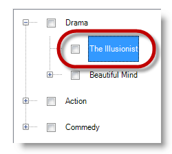
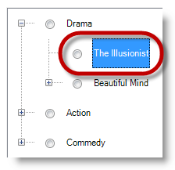

////

|metadata|
{
    "name": "touch-enabled-wintree-control",
    "controlName": [],
    "tags": [],
    "guid": "a1b9879b-8484-483a-93c5-705f7d382582",  
    "buildFlags": [],
    "createdOn": "2013-01-10T21:58:35.2280459Z"
}
|metadata|
////

= Touch-enabled WinTree Control

== Topic Overview

=== Purpose

This topic illustrates the Infragistics touch-enabled link:{ApiPlatform}win.ultrawintree{ApiVersion}~infragistics.win.ultrawintree.ultratree_members.html[WinTree]™ control elements.

=== In this topic

This topic contains the following sections:

* <<_Ref344991627,Touchable  _WinTree_   Control Elements>>

** <<_Ref344991635,Overview>>
** <<_Ref344991643,Default view>>
** <<_Ref344991650,Expansion indicators>>
** <<_Ref344991662,Standard view with checkboxes>>
** <<_Ref344991673,Standard view with Option buttons>>

* <<_Ref342757647,Related Content>>

[[_Ref344991627]]
== Touchable  _WinTree_   Control Elements

[[_Ref344991635]]

=== Overview

The following sections illustrate the touchable elements (outlined) in different views of the  _WinTree™_   control.

.Note:
[NOTE]
====
You can only enable checkboxes and option buttons in the  *Standard*  view.
====

[[_Ref344991643]]

=== Default view

The  _Default_   view is free form, similar to grid-view, displaying the data’s grid structure with column headers. The  _Standard_   view consists of a one-column hierarchical structure, which displays only one column header; the top level in the hierarchy.

[[_Ref344991650]]

=== Expansion indicators

While the expansion indicators themselves do not increase in size, the touchable areas around them are slightly enlarged to facilitate easy user interaction.

[[_Ref344991662]]

=== Standard view with checkboxes

Set the `ViewStyle = Standard` to enable checkboxes.

*In C#:*

[source,csharp]
----
ultraTree1.ViewStyle = ViewStyle.Standard;
ultraTree1.Override.NodeStyle = NodeStyle.CheckBox;
----

*In Visual Basic:*

[source,vb]
----
ultraTree1.ViewStyle = ViewStyle.Standard
ultraTree1.Override.NodeStyle = NodeStyle.CheckBox
----

[[_Ref344991673]]

=== Standard view with Option buttons

Set the `ViewStyle = Standard` to enable option buttons.

*In C#:*

[source,csharp]
----
ultraTree1.ViewStyle = ViewStyle.Standard;
ultraTree1.Override.NodeStyle = NodeStyle.OptionButton;
----

*In Visual Basic:*

[source,vb]
----
ultraTree1.ViewStyle = ViewStyle.Standard
ultraTree1.Override.NodeStyle = NodeStyle.OptionButton
----

[[_Ref342757647]]
== Related Content

=== Topics

The following topics provide additional information related to this topic.

[options="header", cols="a,a"]
|====
|Topic|Purpose

| link:wintouchprovider-overview.html[Touch Support Overview]
|The topic provides conceptual overview of the Infragistics touch-enabled controls and components.

| link:touch-enabled-editor-controls.html[Touch Editor Controls and Elements]
|This topic illustrates the Infragistics touch-enabled editor controls and elements.

| link:touch-enabled-wingrid-control-elements.html[Touch WinGrid Control Elements]
|This topic illustrates the Infragistics touch-enabled _WinGrid_ control elements.

| link:touch-enabled-tab-controls.html[Touch Tab Controls and Components]
|This topic illustrates the Infragistics touch-enabled Tab controls and components, which include _WinTab_ and _WinTabStrip_ controls, and _WinTabbedMdiManager_ component.

| link:touch-enabled-winlistview-control.html[Touch WinListView Control]
|This topic illustrates the Infragistics touch-enabled _WinListView_ control elements.

|====