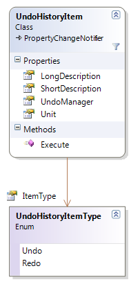

////

|metadata|
{
    "name": "undohistoryitem-properties-and-methods-reference",
    "controlName": [],
    "tags": ["API","Editing","Getting Started"],
    "guid": "0de2607c-c88c-4b1a-b928-968702ba17b6",  
    "buildFlags": [],
    "createdOn": "2012-09-06T12:08:35.3540125Z"
}
|metadata|
////

= UndoHistoryItem Properties and Methods Reference

== Topic Overview

=== Purpose

This topic lists the properties and methods of the UndoHistoryItem class.

=== In this topic

This topic contains the following sections:

* <<_Ref320639296, UndoHistoryItem Class Reference >>
** <<_Ref320803258,Introduction>>
** <<_Ref320803264,Properties reference summary>>
** <<_Ref320803269,Methods reference summary>>

* <<_Ref320639300, Related Content >>

[[_Ref320639296]]
== UndoHistoryItem Class Reference

[[_Ref320803258]]

=== Introduction

The UndoHistoryItem represents a single operation in the undo/redo history.

[[_Ref320803264]]

=== Properties reference summary

The following table summarizes the purpose and functionality of the UndoHistoryItem class key properties.

[options="header", cols="a,a"]
|====
|Property|Description

| link:{ApiPlatform}undo{ApiVersion}~infragistics.undo.undohistoryitem~itemtype.html[ItemType]
|Returns an enumeration indicating the type of operation that will be performed – undo or redo operation.

| link:{ApiPlatform}undo{ApiVersion}~infragistics.undo.undohistoryitem~longdescription.html[LongDescription]
|Returns a detailed description of the performed operation.

| link:{ApiPlatform}undo{ApiVersion}~infragistics.undo.undohistoryitem~shortdescription.html[ShortDescription]
|Returns a short description of the performed operation.

| link:{ApiPlatform}undo{ApiVersion}~infragistics.undo.undohistoryitem~undomanager.html[UndoManager]
|Returns the associated UndoManager instance.

| link:{ApiPlatform}undo{ApiVersion}~infragistics.undo.undohistoryitem~unit.html[Unit]
|Returns the action that will be invoked.

|====

[[_Ref320803269]]

=== Methods reference summary

The following table summarizes the purpose and functionality of the UndoHistoryItem class key methods.

[options="header", cols="a,a"]
|====
|Method|Description

| link:{ApiPlatform}undo{ApiVersion}~infragistics.undo.undohistoryitem~execute.html[Execute]
|Executes all the items in the associated history up to and including this instance.

|====

[[_Ref320639300]]
== Related Content

=== Topics

The following topics provide additional information related to this topic.

[options="header", cols="a,a"]
|====
|Topic|Purpose

| link:observablecollectionextendedwithundo-properties-reference.html[ObservableCollectionExtendedWithUndo Properties Reference]
|This topic lists some of the important properties and methods of the ObservableCollectionExtendedWithUndo class.

| link:undomanager-properties-and-methods-reference.html[UndoManager Properties and Methods Reference]
|This topic lists some of the important properties and methods of the UndoManager class.

| link:undounit-derived-classes-properties-and-methods-reference.html[UndoUnit Derived Classes, Properties and Methods Reference]
|This topic lists the derived classes and some of the important properties and methods of the UndoUnit class.

| link:undounitfactory-properties-and-methods-reference.html[UndoUnitFactory Properties and Methods Reference]
|This topic lists some of the important properties and methods of the UndoUnitFactory class.

|====