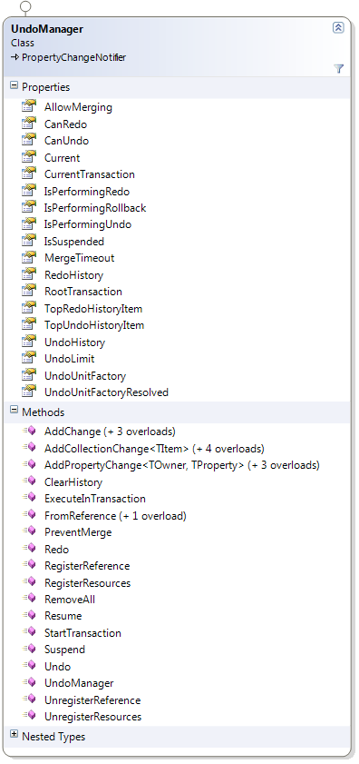

////

|metadata|
{
    "name": "undomanager-properties-and-methods-reference",
    "controlName": [],
    "tags": ["API","Editing","How Do I"],
    "guid": "3cc77300-68e8-443f-b201-a38327610dfc",  
    "buildFlags": [],
    "createdOn": "2012-09-06T12:08:35.3720125Z"
}
|metadata|
////

= UndoManager Properties and Methods Reference

== Topic Overview

=== Purpose

This topic lists some of the important properties and methods of the UndoManager class.

=== In this topic

This topic contains the following sections:

* <<_Ref320610987, UndoManager Class Reference >>
** <<_Ref320807968,Introduction>>
** <<_Ref320807974,Properties reference summary>>
** <<_Ref320807978,Methods reference summary>>

* <<_Ref320610997, Related Content >>

[[_Ref320610987]]
== UndoManager Class Reference

[[_Ref320807968]]

=== Introduction

The UndoManager class provides the functionality for performing undo/redo operations and maintaining the undo/redo history.

Performed operations are saved in history by adding link:{ApiPlatform}undo{ApiVersion}~infragistics.undo.undounit_members.html[UndoUnit] instances to the UndoManager.

.Note
[NOTE]
====
The UndoManager class is not thread safe and it has to be used on a single thread.
====

[[_Ref320807974]]

=== Properties reference summary

The following table summarizes the purpose and functionality of the UndoManager class key properties.

[options="header", cols="a,a"]
|====
|Property|Description

| link:{ApiPlatform}undo{ApiVersion}~infragistics.undo.undomanager~canredo.html[CanRedo]
|Returns a boolean value indicating if there is an operation that can be redone. 

This property determines if there are UndoUnits in the link:{ApiPlatform}undo{ApiVersion}~infragistics.undo.undomanager~redohistory.html[RedoHistory].

| link:{ApiPlatform}undo{ApiVersion}~infragistics.undo.undomanager~canundo.html[CanUndo]
|Returns a boolean value indicating if there is an operation that can be undone. 

This property determines if there are UndoUnits in the link:{ApiPlatform}undo{ApiVersion}~infragistics.undo.undomanager~undohistory.html[UndoHistory].

| link:{ApiPlatform}undo{ApiVersion}~infragistics.undo.undomanager~current.html[Current]
|Returns a thread static singleton instance of an UndoManager. 

Another way to use the UndoManager class is to create a new instance. Each instance maintains its own history.

| link:{ApiPlatform}undo{ApiVersion}~infragistics.undo.undomanager~isperformingredo.html[IsPerformingRedo]
|Returns a boolean value indicating if the manager is performing a redo operation. 

While `IsPerformingRedo` is _True_, the `UndoUnits` are added in the undo history because redo operations are performed.

| link:{ApiPlatform}undo{ApiVersion}~infragistics.undo.undomanager~isperformingundo.html[IsPerformingUndo]
|Returns a boolean value indicating if the manager is performing an undo operation. 

While `IsPerformingUndo` is _True_, the `UndoUnits` are added in the redo history because undo operations are performed.

| link:{ApiPlatform}undo{ApiVersion}~infragistics.undo.undomanager~redohistory.html[RedoHistory]
|Returns a read-only collection of the link:{ApiPlatform}undo{ApiVersion}~infragistics.undo.undohistoryitem_members.html[UndoHistoryItem] instances in the redo history.

| link:{ApiPlatform}undo{ApiVersion}~infragistics.undo.undomanager~undohistory.html[UndoHistory]
|Returns a read-only collection of the `UndoHistoryItem` instances in the undo history.

|====

[[_Ref320807978]]

=== Methods reference summary

The following table summarizes the purpose and functionality of the UndoManager class key methods.

[options="header", cols="a,a"]
|====
|Method|Description

| link:{ApiPlatform}undo{ApiVersion}~infragistics.undo.undomanager~addchange.html[AddChange]
|Adds an `UndoUnit` to the history. 

There are several overloads of this method. 

One of them takes a given `UndoUnit` as an argument. 

The others take Action or Func<> instances that represents the methods to call when the operation is undone/redone.

| link:{ApiPlatform}undo{ApiVersion}~infragistics.undo.undomanager~addcollectionchange.html[AddCollectionChange]
|Adds an `UndoUnit` for the specified collection change to the undo history.

| link:{ApiPlatform}undo{ApiVersion}~infragistics.undo.undomanager~addpropertychange.html[AddPropertyChange]
|Adds a link:{ApiPlatform}undo{ApiVersion}~infragistics.undo.propertychangeundounitbase_members.html[PropertyChangeUndoUnitBase] for the specified property value change to the undo history.

| link:{ApiPlatform}undo{ApiVersion}~infragistics.undo.undomanager~clearhistory.html[ClearHistory]
|Clears the undo and redo history.

| link:{ApiPlatform}undo{ApiVersion}~infragistics.undo.undomanager~foreach.html[ForEach]
|Enumerates the `UndoUnit` instances within the undo and redo history and invokes the provided `Action<UndoUnit>` delegate.

| link:{ApiPlatform}undo{ApiVersion}~infragistics.undo.undomanager~fromreference.html[FromReference]
|Once an object is associated with the UndoManager, you can use this to obtain a reference to the UndoManager instance when it’s needed.

| link:{ApiPlatform}undo{ApiVersion}~infragistics.undo.undomanager~redo.html[Redo]
|Performs one or more redo operations using the current history.

| link:{ApiPlatform}undo{ApiVersion}~infragistics.undo.undomanager~registerreference.html[RegisterReference]
|Associates an object with an UndoManager instance.

| link:{ApiPlatform}undo{ApiVersion}~infragistics.undo.undomanager~resume.html[Resume]
|Resumes the suspended recording of `UndoUnit` instances in the history.

| link:{ApiPlatform}undo{ApiVersion}~infragistics.undo.undomanager~starttransaction.html[StartTransaction]
|Creates and starts an link:{ApiPlatform}undo{ApiVersion}~infragistics.undo.undotransaction_members.html[UndoTransaction]. This is useful when multiple operations have to be saved in the undo/redo history as one entry.

| link:{ApiPlatform}undo{ApiVersion}~infragistics.undo.undomanager~suspend.html[Suspend]
|Suspends the recording of `UndoUnit` instances in the history. 

You may need this method when initializing objects or collections or loading initial data. 

When the recording is suspended, calling the `Undo` or `Redo` methods will result in an exception.

| link:{ApiPlatform}undo{ApiVersion}~infragistics.undo.undomanager~undo.html[Undo]
|Performs one or more undo operations using the current history.

| link:{ApiPlatform}undo{ApiVersion}~infragistics.undo.undomanager~unregisterreference.html[UnregisterReference]
|Removes a registration created with `RegisterReference` method for an object that was registered with UndoManager instance.

|====

[[_Ref320610997]]
== Related Content

=== Topics

The following topics provide additional information related to this topic.

[options="header", cols="a,a"]
|====
|Topic|Purpose

| link:observablecollectionextendedwithundo-properties-reference.html[ObservableCollectionExtendedWithUndo Properties Reference]
|This topic lists some of the important properties and methods of the ObservableCollectionExtendedWithUndo class.

| link:undohistoryitem-properties-and-methods-reference.html[UndoHistoryItem Properties and Methods Reference]
|This topic lists the properties and methods of the UndoHistoryItem class.

| link:undounit-derived-classes-properties-and-methods-reference.html[UndoUnit Derived Classes, Properties and Methods Reference]
|This topic lists the derived classes and some of the important properties and methods of the UndoUnit class.

| link:undounitfactory-properties-and-methods-reference.html[UndoUnitFactory Properties and Methods Reference]
|This topic lists some of the important properties and methods of the UndoUnitFactory class.

|====