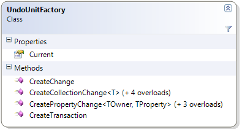

////

|metadata|
{
    "name": "undounitfactory-properties-and-methods-reference",
    "controlName": [],
    "tags": ["API","Tips and Tricks"],
    "guid": "6d8bab7e-67d6-49a0-bd96-502f4687a295",  
    "buildFlags": [],
    "createdOn": "2012-09-06T12:08:35.3790125Z"
}
|metadata|
////

= UndoUnitFactory Properties and Methods Reference

== Topic Overview

=== Purpose

This topic lists some of the important properties and methods of the UndoUnitFactory class.

=== In this topic

This topic contains the following sections:

* <<_Ref320690863, UndoUnitFactory Class Reference >>
** <<_Ref320801062,Introduction>>
** <<_Ref320801069,Properties reference summary>>
** <<_Ref320801075,Methods reference summary>>

* <<_Ref320690868, Related Content >>

[[_Ref320690863]]
== UndoUnitFactory Class Reference

[[_Ref320801062]]

=== Introduction

The link:{ApiPlatform}undo{ApiVersion}~infragistics.undo.undounitfactory_members.html[UndoUnitFactory] is a factory class used for creating link:{ApiPlatform}undo{ApiVersion}~infragistics.undo.undounit_members.html[UndoUnit] instances.

The UndoUnitFactory class provides methods using the link:undounit-derived-classes-properties-and-methods-reference.html#_derived[derived UndoUnit classes]. They may be overridden to provide custom `UndoUnit` classes.

[[_Ref320801069]]

=== Properties reference summary

The following table summarizes the purpose and functionality of the UndoUnitFactory class key properties.

[options="header", cols="a,a"]
|====
|Property|Description

| link:{ApiPlatform}undo{ApiVersion}~infragistics.undo.undounitfactory~current.html[Current]
|Returns the default factory used to create `UndoUnit` instances for use in an UndoManager 

.Note 

[NOTE] 

==== 

The Current property is not thread static and will affect all threads and therefore the UndoUnitFactory class should be thread safe. 

====

|====

[[_Ref320801075]]

=== Methods reference summary

The following table summarizes the purpose and functionality of the UndoUnitFactory class key methods.

[options="header", cols="a,a"]
|====
|Method|Description

| link:{ApiPlatform}undo{ApiVersion}~infragistics.undo.undounitfactory~createchange.html[CreateChange]
|Creates an `UndoUnit` for the specified method.

| link:{ApiPlatform}undo{ApiVersion}~infragistics.undo.undounitfactory~createcollectionchange.html[CreateCollectionChange]
|Creates an `UndoUnit` for a collection change based upon a specified `System.Collections.Specialized.NotifyCollectionChangedEventArgs`.

| link:{ApiPlatform}undo{ApiVersion}~infragistics.undo.undounitfactory~createpropertychange.html[CreatePropertyChange]
|Creates an link:{ApiPlatform}undo{ApiVersion}~infragistics.undo.propertychangeundounitbase_members.html[PropertyChangeUndoUnitBase] for the specified property change.

| link:{ApiPlatform}undo{ApiVersion}~infragistics.undo.undounitfactory~createtransaction.html[CreateTransaction]
|Creates an link:{ApiPlatform}undo{ApiVersion}~infragistics.undo.undotransaction_members.html[UndoTransaction].

|====

[[_Ref320690868]]
== Related Content

=== Topics

The following topics provide additional information related to this topic.

[options="header", cols="a,a"]
|====
|Topic|Purpose

| link:observablecollectionextendedwithundo-properties-reference.html[ObservableCollectionExtendedWithUndo Properties Reference]
|This topic lists some of the important properties of the ObservableCollectionExtendedWithUndo class.

| link:undohistoryitem-properties-and-methods-reference.html[UndoHistoryItem Properties and Methods Reference]
|This topic lists the properties and methods of the UndoHistoryItem class.

| link:undomanager-properties-and-methods-reference.html[UndoManager Properties and Methods Reference]
|This topic lists some of the important properties and methods of the UndoManager class.

| link:undounit-derived-classes-properties-and-methods-reference.html[UndoUnit Derived Classes, Properties and Methods Reference]
|This topic lists the derived classes and some of the important properties and methods of the UndoUnit class.

|====