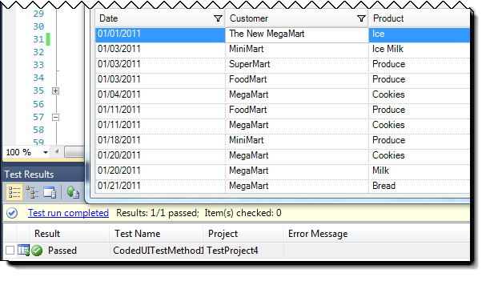
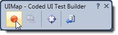
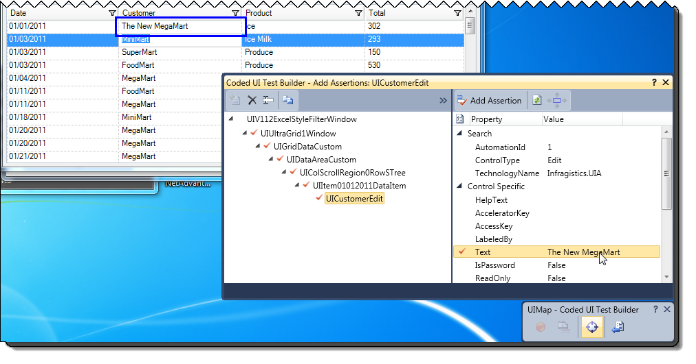
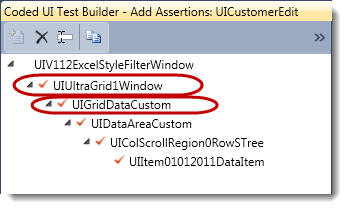

////

|metadata|
{
    "name": "using-the-coded-ui-test-extension",
    "controlName": [],
    "tags": [],
    "guid": "2d13ff83-6931-45ca-b4ea-1c3000b9adb9",  
    "buildFlags": [],
    "createdOn": "2012-09-14T17:18:18.2456217Z"
}
|metadata|
////

= Using the Coded UI Test Extension

== Topic Overview

=== Purpose

This topic demonstrates how the Coded UI Test Extension works with a simple WinGrid sample.

=== In this topic

This topic contains the following sections:

* <<_Record_and_Replay,Record and Replay: Editing a Cell in the WinGrid>>
* <<_Related_Content,Related Content>>

[[_Introduction]]
[[_Supported_Controls]]
[[_System_Requirements]]
[[_Licensing_Requirements]]
[[_Record_and_Replay]]
== Record and Replay: Editing a Cell in the WinGrid

=== Introduction

The Coded UI Test Extension allows you to record and replay actions on Infragistics controls with Coded UI Test. This procedure assumes a basic familiarity with using Microsoft Coded UI Test. In this example, the Coded UI Extension allows the WinGrid to participate in recording and replaying of text editing actions in a cell.

=== Preview

The following screenshot is a preview of the result. The value in first Customer cell has been modified to “The New MegaMart” by the successful replay of a Coded UI Test. Observe that the Test Results window, at the bottom of the figure, indicates that the test has passed.

=== Prerequisites

To complete the procedure, you need the following:

* link:coded-ui-test-extension-overview.html#_System_Requirements[System Requirements (Coded UI Test Extension Overview)]
* link:coded-ui-test-extension-overview.html#_Licensing_Requirements[Licensing Requirements (Coded UI Test Extension Overview)]

=== Steps

The following steps demonstrate how to confirm that the Coded UI Test Extension records and replays the text editing actions within a WinGrid cell and asserts that the cell’s value has changed successfully.

=== 1. Create the Coded UI Test

**Follow the normal steps to cr****eate a new Coded UI Test in Visual Studio****.*

_Hint:_  Start at menu option:  _Test > New T_  _est_  _…_   _> Coded UI Test_

Note: The Coded UI Test project’s references automatically includes all versions of the Infragistics Coded UI Text Extension assembly existing on the machine; as shown below.

image::images/Using_the_Coded_UI_Test_Extension_2a.png[]

=== 2. Run the Application Under Test (AUT)

*Run the*Application* *Under Test*

The application contains a WinGrid bound to a data source. The test being recorded will involve editing a WinGrid cell.

=== 3. Begin the recording session.

Use the Coded UI Test Builder to begin recording actions against the WinGrid.

=== 4. Edit the cell.

Click in a text cell and change the value, then tab or click to another cell to end edit mode.

=== 5. End the recording.

Click the Pause button in the Coded UI Test Builder to end the recording.

=== 6. Generate the code.

Click the Generate Code button to create the code method that can be used to replay this recording. The resulting code will be similar to the following.

*Record/replay code:*

*In C#:*

[source,csharp]
----
public void RecordedMethod1()
{
  #region Variable Declarations
  UltraUiaEdit uICustomerEdit = this.UIV112ExcelStyleFilterWindow.UIUltraGrid1Window.UIGridDataCustom.UIDataAreaCustom.UIColScrollRegion0RowSTree.UIItem01012011DataItem.UICustomerEdit;
  UltraUiaCustom uIGridDataCustom1 = this.UIV112ExcelStyleFilterWindow.UIUltraGrid1Window.UIGridDataCustom1;
  UltraUiaEdit uICustomerEdit1 = this.UIV112ExcelStyleFilterWindow.UIUltraGrid1Window.UIGridDataCustom.UIDataAreaCustom.UIColScrollRegion0RowSTree.UIItem01032011DataItem.UICustomerEdit;
#endregion
// Click 'Customer' text box
Mouse.Click(uICustomerEdit, new Point(5, 8));
// Click 'gridData' custom control
Mouse.Click(uIGridDataCustom1, new Point(168, 33));
// Type 'The{Space}New{Space}' in 'gridData' custom control
Keyboard.SendKeys(uIGridDataCustom1, this.RecordedMethod2Params.UIGridDataCustom1SendKeys, ModifierKeys.None);
// Click 'Customer' text box
Mouse.Click(uICustomerEdit1, new Point(80, 6));
}
----

Observe that the automatically generated field “UIGRidCustom1SendKeys”, in the “RecordedMethod2Params” class contains the Coded UI Test’s recording of the user’s key press sequence.

*In C#:*

[source,csharp]
----
public class RecordedMethod2Params
    {
        #region Fields
        /// 

        /// Type 'The{Space}New{Space}' in 'gridData' custom control
        /// 

        public string UIGridDataCustom1SendKeys = "The{Space}New{Space}";
        #endregion
    }
----

=== 7. Add the Assertion

*Add the assertion to verify that the value of the cell*has been changed* *to the new value as expected.*

The following screenshot shows the assertion being added to verify that the cell’s text has changed from “MegaMart” to “The New MegaMart”.

Observe the presence of the “UltraGrid1Window” in the assertion object tree. This is a wrapper around the WinGrid control. The Coded UI Test Extension implementation exposes the “UIGridDataCustom” object and its children. These are highlighted in the screenshot below:

=== 8. Generate the code.

Click the Generate Code button to create the code method that can be used to assert the value of the text after it has been altered in the test. The resulting code will be similar to the following.

Assertion Code:

*In C#:*

[source,csharp]
----
public void AssertMethod1()
{
    #region Variable Declarations
    UltraUiaEdit uICustomerEdit = this.UIV112ExcelStyleFilterWindow.UIUltraGrid1Window1.UIGridDataCustom.UIDataAreaCustom.UIColScrollRegion0RowSTree.UIItem01012011DataItem.UICustomerEdit;
    #endregion
    // Verify that 'Customer' text box's property 'Text' equals 'The New MegaMart'
    Assert.AreEqual(this.AssertMethod1ExpectedValues.UICustomerEditText, uICustomerEdit.Text);
}
----

=== 9. Replay the test.

Restart the AUT, or return it to its original state, then run the Coded UI Test in Visual Studio.

[[_Related_Content]]
== Related Content

=== Topics

The following topics provide additional information related to this topic.

[options="header", cols="a,a"]
|====
|Topic|Purpose

| link:coded-ui-test-extension-overview.html[Coded UI Test Extension Overview]
|This topic explains what the Coded UI Test Extension entails, lists the supported controls, and provides system and licensing requirements.

|====