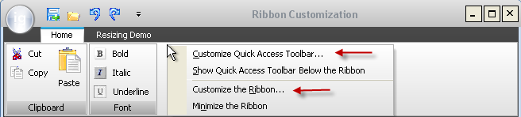
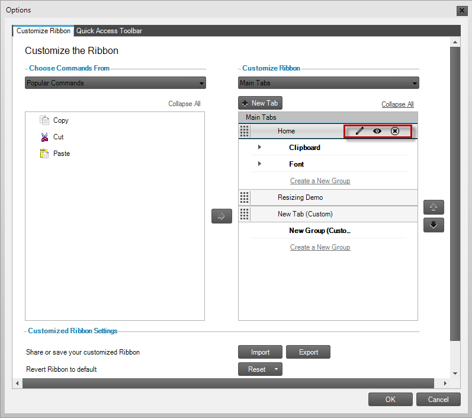

////

|metadata|
{
    "name": "wants-new-for-wintoolbarsmanager",
    "controlName": [],
    "tags": ["Commands","Editing"],
    "guid": "4d8be528-04a7-4f75-9938-ccbbe300b5b2",  
    "buildFlags": [],
    "createdOn": "2011-05-13T17:40:10.0026752Z"
}
|metadata|
////

= What's New for WinToolbarsManager

== Ribbon Customization

With the release of Office 2010, Microsoft® provides their users the ability to customize the layout of the Ribbon within each Office application. This release of Infragistics Windows Forms 2011 Volume 1 provides the ability for end users to modify WinToolbarsManager™ component’s Ribbon layout, in a similar manner.

== New Component – WinRibbonCustomizationProvider™

The customization is achieved with a new component called WinRibbonCustomizationProvider™, which when hooked to WinToolbarsManager provides a new dialog that exposes the customization functionality.

*In C#:*

----
using Infragistics.Win.UltraWinToolbars;
this.ultraToolbarsManager1.Ribbon.RibbonCustomizationProvider = this.ultraRibbonCustomizationProvider1;
----

*In Visual Basic:*

----
Imports Infragistics.Win.UltraWinToolbars
Me.ultraToolbarsManager1.Ribbon.RibbonCustomizationProvider = this.ultraRibbonCustomizationProvider1
----

== New Context Menu Items – Customize the Ribbon and Customize Quick Access Toolbar

Two new context menu items – Customize the Ribbon and Customize Quick Access Toolbar is automatically available on the Ribbon as soon as the WinRibbonCustomizationProvider component is hooked up to WinToolbarsManager.

Selecting one of these new context menu items displays a new dialog enabling the user to:

* Perform the following actions on Ribbon Tab, groups, and Tools:

** Add
** Remove
** Show/Hide
** Rename
** Reposition

* Import/Export the layout of the Ribbon.
* Reset the Ribbon back to its original layout.

== Customization Dialog

== Related Topics

* link:winribboncustomizationprovider-about-winribboncustomizationprovider.html[About WinRibbonCustomizationProvider]
* link:winribboncustomizationprovider-using-the-ribbon-customization-dialog.html[Using the Ribbon Customization Dialog]
* link:winribboncustomizationprovider-adding-custom-tab-to-ribbon-customization-dialog.html[Add Custom Tabs to Ribbon Customization Dialog]