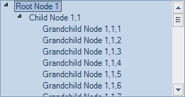
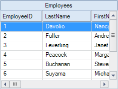

////

|metadata|
{
    "name": "whats-new-application-styling-new-office-2010-look-and-feel",
    "controlName": [],
    "tags": [],
    "guid": "b5b99fa2-cf6c-4788-bf94-ee7514b0bb44",  
    "buildFlags": [],
    "createdOn": "2010-09-16T20:30:54.5810255Z"
}
|metadata|
////

= New Office 2010 Look and Feel

With this release of Infragistics Windows Forms, your application can get the new Microsoft® Office 2010 look and feel. A new Office2010Blue StyleSet has been added to our Style Library. You can take advantage of this new style by loading the StyleSet (isl file) into your application, using the link:{ApiPlatform}win.v{ProductVersion}~infragistics.win.appstyling.stylemanager~load.html[Load] method of the link:{ApiPlatform}win.v{ProductVersion}~infragistics.win.appstyling.stylemanager.html[StyleManager] class. Now your entire application can take advantage of this new style.

WinTree with Office2010Blue StyleSet applied

WinGrid with Office2010Blue StyleSet applied

Related Topic:

link:styling-guide-loading-a-stylelibrary.html[Loading a Style Library]