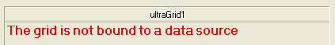
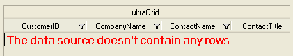
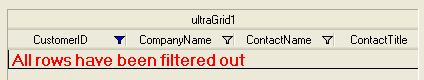

////

|metadata|
{
    "name": "whats-new-in-2012-volume-1",
    "controlName": [],
    "tags": [],
    "guid": "514be838-d9b3-42dc-ba03-8997a274126c",  
    "buildFlags": [],
    "createdOn": "2012-02-09T17:27:42.9873016Z"
}
|metadata|
////

= What's New in 2012 Volume 1

[[topictop]]

This topic provides an overview of the new functionalities and components introduced with the Infragistics Windows Forms 2012 Volume 1 release.

This topic contains the following sections:

*New Functionalities and Components*

** <<ExcelEngine,Infragistics Excel Engine>>
** <<WinGanttViewPrintDocument,WinGanttViewPrintDocument>>
** <<WinGridEmptyMessage,WinGrid - Empty Message>>
** <<WinGridExternalFiltering,WinGrid - External Filtering>>
** <<WinGridExternalSummaryCalculations,WinGrid - External Summary Calculations>>
** <<WinGridRowsCollection,WinGrid - Rows Collection in Filter Changed Events>>

[[ExcelEngine]]
== Infragistics Excel Engine

The following table summarizes the new Infragistics Excel Engine features included with the 2012 Volume 1 release.

=== Accessing Cells and Regions by their Reference Name

The Worksheet object’s link:{ApiPlatform}documents.excel.v{ProductVersion}~infragistics.documents.excel.worksheet~getcell.html[GetCell] and link:{ApiPlatform}documents.excel.v{ProductVersion}~infragistics.documents.excel.worksheet~getregion.html[GetRegion] methods now accept a reference name denoting a cell or range. Previously these methods accepted only the address of the cell or region.

==== Related Topics:

* link:excelengine-accessing-cells-and-cell-regions-by-name.html[Accessing Cells and Regions by Their Reference Name]

=== Excel format support

Excel library now supports accessing built-in styles, parent styles, format options, numerous Microsoft Excel behaviors regarding styles, and possibility for determining resolved cell formats.

==== Related Topics:

* link:excelengine-excel-format-support.html[Excel Format Support]

=== Excel 2007 Color Model

This release introduces an updated color object model. Using Excel 2007 Color model you can specify a color, work with Workbook palette and use new link:{ApiPlatform}documents.excel.v{ProductVersion}~infragistics.documents.excel.iworksheetcellformat~fill.html[Fill] property for filing a cells.

==== Related Topics:

* link:excelengine-excel-2007-color-model.html[Excel 2007 Color Model]

=== Support named tables in an Excel spreadsheet

The Excel library now supports the ability to access and create named Tables with data from the worksheet. The tables can be sorted, filtered, and aggregated.

==== Related Topics:

* link:excelengine-support-named-tables-in-an-excel-spreadsheet.html[Support Named Tables in an Excel spreadsheet]

=== Filtering tables

Filtering is done by applying a filter. When the filter is applied on a column, all filters in the table will be reevaluated to determine which rows should be visible. This operation will show rows where all cells meet their table columns’ filter criteria.

==== Related Topics:

* link:excelengine-filtering-tables.html[Filtering Tables]

=== Sorting tables

Sorting is done by setting a sorting condition on a table column. When a sorting condition is set on a column, all sort conditions in the table will be reevaluated to determine the order of the cells in the table. When cells need to be moved to meet their sort criteria, the entire row of cells in the table is moved as a unit. If the data in the table is subsequently changed, the sort condition will not be reevaluated.

==== Related Topics:

* link:excelengine-sorting-tables.html[Sorting Tables]

=== Getting cell text

This topic describes how to determine the text that would be displayed in a Microsoft Excel cell given the cell’s value, format string, column width, and worksheet options.

==== Related Topics:

* link:excelengine-retrieving-the-cell-text-as-displayed-in-excel.html[Retrieving the Cell Text as Displayed in Excel (Get Cell Text)]

== Related Content

=== Topics

The following topics provide additional information related to this topic.

[options="header", cols="a,a"]
|====
|Topic|Purpose

| link:excelengine-using-the-infragistics-excel-engine.html[Using the Infragistics Excel Engine]
|This section is your gateway to important task-based information that will help you to effectively use the various features and functionalities provided by the Infragistics Excel Engine.

|====

=== Samples

The following samples provide additional information related to this topic.

[options="header", cols="a,a"]
|====
|Sample|Purpose

|Named Tables
|This sample demonstrates a way of working with Named Tables in Excel. You can format worksheet regions as tables, you can specify a name for each table and get a table by name, and you can specify a style to apply to a table. You can get and set sort conditions and filters for each column of a table. You can specify different options - table style, column sort directions, column filters, and save the Excel file to see the applied settings.

|New Color Model
|This sample demonstrates a way of working with the newer color model on cell formats. You can specify the RGB color and a tint value on all color properties of a cell format. You can use linear and rectangular gradients in cells.

|====

^<<topictop,Back to features>>

== WinGanttViewPrintDocument

[[WinGanttViewPrintDocument]]

Starting with 2012 Volume 1 of Infragistics Windows Forms, end-users can print the content of the UltraGanttView™ used in your application. This is achieved through a new component called UltraGanttViewPrintDocument™ which is added to the Windows Forms toolset. This component gives you full control over positioning and customization of legends in the printed document, in a way similar to that of the Microsoft® Project.

== Related Content

=== Topics

The following topics provide additional information related to this topic.

[options="header", cols="a,a"]
|====
|Topic|Purpose

| link:winganttviewprintdocument-print-preview-with-winganttviewprintdocument.html[Print Preview with WinGanttViewPrintDocument]
|This topic explains how to use the Print Preview feature of theWinGanttViewPrintDocument™. In the particular example in this topic, the WinGanttViewPrintDocument™ is used with the WinPrintPreviewDialog™ to print preview the WinGanttView™ control.

| link:winganttviewprintdocument-configuring-the-legend.html[Configuring the Legend]
|This topic provides information about the Legend feature of the WinGanttViewPrintDocument™ component.

| link:winganttviewprintdocument-customizing-the-print-version-of-the-winganttview-control.html[Customizing the Print Version of the WinGanttView Control]
|This topic explains, with code examples, how to customize the Print Version of the WinGanttView control using the link:{ApiPlatform}win.ultrawinganttview.v{ProductVersion}~infragistics.win.ultrawinganttview.ultraganttviewprintdocument~initializeganttview_ev.html[InitializeGanttView] event.

|====

^<<topictop,Back to features>>

[[WinGridEmptyMessage]]
== WinGrid - Empty Message

In WinGrid™ you can display a customized message at run time indicating that the grid has no data source bound to it or is bound to a data source that contains no rows.

[[_Ref319929275]]
== New/Main Features

=== Features Overview

The following table summarizes the new empty message features of the WinGrid control.

[options="header", cols="a,a"]
|====
|Feature|Description

|<<_Ref319934753,No Data Source Message>>
|When no data source is defined on the WinGrid a message is displayed to notify the user

|<<_Ref319934758,No Rows Message>>
|When a data source is defined, but contains no rows a message is displayed to notify the user

|<<_Ref319934762,No Visible Rows Message>>
|When a data source is defined, contains rows, but all rows have been filtered out, a message is displayed to notify the user

|====

[[_Ref319934753]]

=== No Data Source Message

When no data source is defined on the WinGrid, a customizable message can be displayed to notify the user.

==== Related Topics:

* link:wingrid-displaying-empty-message-in-wingrid.html[Displaying Empty Message in WinGrid]

[[_Ref319934758]]

=== No Rows Message

When a data source is defined, but contains no rows a customizable message can be displayed to notify the user.

==== Related Topics:

* link:wingrid-displaying-empty-message-in-wingrid.html[Displaying Empty Message in WinGrid]

[[_Ref319934762]]

=== No Visible Rows Message

When a data source is defined and contains rows, but all rows are filtered out, a customizable message can be displayed to notify the user.

==== Related Topics:

* link:wingrid-displaying-empty-message-in-wingrid.html[Displaying Empty Message in WinGrid]

== Related Content

=== Topics

The following topics provide additional information related to this topic.

[options="header", cols="a,a"]
|====
|Topic|Purpose

| link:wingrid-displaying-empty-message-in-wingrid.html[Displaying Empty Message in WinGrid]
|This topic shows you how to display a customized message at run time indicating that the grid has no data source bound to it, is bound to a data source that contains no rows, or all rows are filtered out.

| link:wingrid-binding-wingrid-to-a-flat-data-source-clr2.html[Binding WinGrid to a Flat Data Source]
|This topic shows you how to add the WinGrid control to a Visual Studio .NET project and bind it to a flat data source (contains no child rows).

| link:wingrid-binding-wingrid-to-a-hierarchical-data-source-clr2.html[Binding WinGrid to a Hierarchical Data Source]
|This topic shows you how to add the WinGrid control to a Visual Studio .NET project and bind it to a hierarchical data source (contains child rows) .

|====

^<<topictop,Back to features>>

[[WinGridExternalFiltering]]
== WinGrid - External Filtering

Starting with 2012 Volume 1 of Infragistics Windows Forms, the WinGrid™ control allows external filtering. With external filtering, it is possible to filter data on WinGrid with custom filtering logic and also have the Load-On-Demand functionality enabled. Previously, when filtering was performed, the UltraGrid control used to load all rows and iterate over all of them making the link:{ApiPlatform}win.ultrawingrid.v{ProductVersion}~infragistics.win.ultrawingrid.loadstyle.html[LoadOnDemand] setting ineffective. Now it is possible to bypass this internal filtering logic, but retain the built-in filtering UI and supply custom filtering code.

For details on how to use this feature, see the link:wingrid-enabling-external-filtering.html[Enabling External Filtering] topic.

== Related Content

The following topics provide additional information related to this topic.

[options="header", cols="a,a"]
|====
|Topic|Purpose

| link:wingrid-enabling-external-filtering.html[Enabling External Filtering]
|This topic demonstrates, with code examples, how to enable and implement external filtering functionality in the WinGrid™ control.

|====

^<<topictop,Back to features>>

[[WinGridExternalSummaryCalculations]]
== WinGrid - External Summary Calculations

Starting with 2012 Volume 1 of Infragistics Windows Forms, it is possible to perform summary calculations on the WinGrid™ control along with the Load-On-Demand feature enabled. Previously, when summary calculations were performed, the WinGrid controls’ calculation logic used to iterate through the rows collection and load all data. Now it is possible to bypass this internal summary calculation logic and supply the summary value directly, without requesting all of the data to be loaded and thereby avoiding the iteration of the rows collection.

For details on how to use this feature, see the link:wingrid-performing-external-summary-calculations.html[Performing External Summary Calculations] topic.

== Related Content

The following topic provides additional information related to this topic.

[options="header", cols="a,a"]
|====
|Topic|Purpose

| link:wingrid-performing-external-summary-calculations.html[Performing External Summary Calculations]
|This topic explains, with code examples, the most common tasks related to performing external summary calculations in the UltraGrid™ control.

|====

^<<topictop,Back to features>>

[[WinGridRowsCollection]]
== WinGrid - Rows Collection in Filter Changed Events

In the WinGrid™ control, the event arguments in the `BeforeRowFilterChanged` and `AfterRowFilterChanged` events contain a `RowsCollection` that make it easier to perform external processing and filtering. A `RowsCollection` is provided during the `BeforeRowFilterChanged` and `AfterRowFilterChanged` events that expose the rows the column filter is being applied to.

== Related Content

The following topic provides additional information related to this topic.

[options="header", cols="a,a"]
|====
|Topic|Purpose

| link:wingrid-performing-external-summary-calculations.html[Performing External Summary Calculations]
|This topic explains, with code examples, the most common tasks related to performing external summary calculations in the UltraGrid™ control.

| link:wingrid-binding-wingrid-to-a-flat-data-source-clr2.html[Binding WinGrid to a Flat Data Source]
|This topic shows you how to add the WinGrid control to a Visual Studio .NET project and bind it to a flat data source (contains no child rows).

| link:wingrid-binding-wingrid-to-a-hierarchical-data-source-clr2.html[Binding WinGrid to a Hierarchical Data Source]
|This topic shows you how to add the WinGrid control to a Visual Studio .NET project and bind it to a hierarchical data source (contains child rows).

|====

^<<topictop,Back to features>>