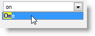
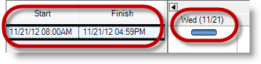
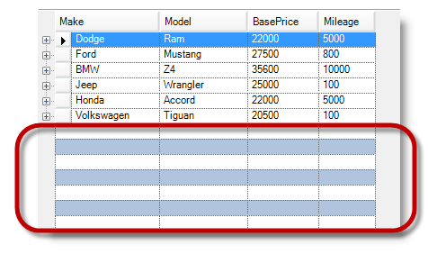
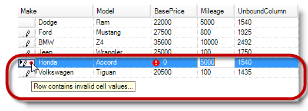
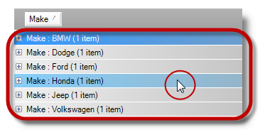
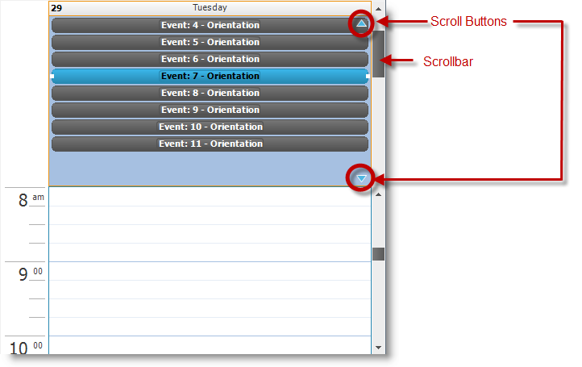

////

|metadata|
{
    "name": "whats-new-in-2013-volume-1",
    "controlName": [],
    "tags": [],
    "guid": "53206436-9e53-4cc4-8189-c1fa43062e40",  
    "buildFlags": [],
    "createdOn": "2013-01-08T17:54:45.4288031Z"
}
|metadata|
////

= What's New in 2013 Volume 1

=== Features Overview

The following table summarizes the new features of the  _Infragistics_   Windows Forms 2013 Volume 1. Additional details follow the summary table.

++++
<table cellspacing="0" cellpadding="0">
    <tbody>
        <tr>
            <th>
                
Control

            </th>

            <th>
                
Feature

            </th>

            <th>
                
Description

            </th>
        </tr>

        <tr>
            <td>
                

                    <a href="#_Ref350521203">Gestures for Touch-enabled Controls</a>
                

            </td>

            <td>
                

                    <a href="#_Ref350521227">Touch Gestures</a>
                

            </td>

            <td>
                
Presents touch gestures for Infragistics touch-enabled controls.

            </td>
        </tr>

        <tr>
            <td>
                

                    <a href="#_Ref346785024">WinActivityIndicator</a>
                

            </td>

            <td>
                

                    <a href="#_Ref346785035">Displaying Text on Activity Indicator</a>
                

            </td>

            <td>
                
Allows the control to display text whether or not it is an ongoing activity.

            </td>
        </tr>

        <tr>
            <td>
                

                    <a href="#_Ref349910337">WinComboEditor</a>
                

            </td>

            <td>
                

                    <a href="#_Ref349910347">AutoSuggest Highlight Appearance</a>
                

            </td>

            <td>
                
Extends the valueList’s capability allowing styling and highlighting of the drop-down list of items.

            </td>
        </tr>

        <tr>
            <td>
                

                    <a href="#_Ref349910356">WinDateTimeEditor</a>
                

            </td>

            <td>
                

                    <a href="#_Ref349910365">Prevent From Typing Into WinDateTimeEditor</a>
                

            </td>

            <td>
                
Configures the WinDateTimeEditor with additional option to prevent the user from typing
                directly into the DateTime editor.

            </td>
        </tr>

        <tr>
            <td>
                

                    <a href="#_Ref349910372">WinDesktopAlert</a>
                

            </td>

            <td>
                

                    <a href="#_Ref349910379">Exposing OpenAlert Windows</a>
                

            </td>

            <td>
                
Exposes open alert windows and enables you to navigate thought them.

            </td>
        </tr>

        <tr>
            <td>
                

                    <i><a href="#_Ref346785111"><i>WinForms</i> Editor Controls</a></i>
                

            </td>

            <td>
                

                    <a href="#_Ref346785121">Touch-Enabled Editor Controls and Elements</a>
                

            </td>

            <td>
                
Presents the WinForms editor controls’ touchable visual elements.

            </td>
        </tr>

        <tr>
            <td>
                

                    <i><a href="#_Ref346785133"><i>WinForms</i> Tab Controls and Components</a></i>
                

            </td>

            <td>
                

                    <a href="#_Ref346785143">Touch-Enabled Editor Controls and Elements</a>
                

            </td>

            <td>
                
Presents the WinForms Tab controls’ and components’ touchable visual elements.

            </td>
        </tr>

        <tr>
            <td>
                

                    <a href="#_Ref346785151">WinGanttView</a>
                

            </td>

            <td>
                

                    <a href="#_Ref346785159">Timeline Task Positioning</a>
                

            </td>

            <td>
                
Configures scheduled tasks’ precise position and size.

            </td>
        </tr>

        <tr>
            <td rowspan="4">
                

                    <a href="#_Ref346785172">WinGrid</a>
                

            </td>

            <td>
                

                    <a href="#_Ref346785183">Alternate Row Appearance for Empty Rows</a>
                

            </td>

            <td>
                
Displays empty WinGrid rows with alternate rows appearance.

            </td>
        </tr>

        <tr>
            <td>
                

                    <a href="#_Ref347760633">DataErrorInfo Support</a>
                

            </td>

            <td>
                
Extends the data validation support to use DataErrorInfo, allowing independent data
                validation handling from the IDataErrorInfo interface.

            </td>
        </tr>

        <tr>
            <td>
                

                    <a href="#_Ref346785218">Grouped Rows HotTracking Appearance</a>
                

            </td>

            <td>
                
Configures HotTracking appearance on grouped rows in WinGrid.

            </td>
        </tr>

        <tr>
            <td>
                

                    <a href="#_Ref346785228">Touch-Enabled WinGrid Control Elements</a>
                

            </td>

            <td>
                
Presents the WinGrid control’s touchable visual elements.

            </td>
        </tr>

        <tr>
            <td>
                

                    <a href="#_Ref346785740">WinGridExcelExporter</a>
                

            </td>

            <td>
                

                    <a href="#_Ref346785766">Exporting DropDown List to Excel</a>
                

            </td>

            <td>
                
Enables exporting drop-down lists to Excel, for example the WinComboEditor embedded in
                the WinGrid containing ValueList with drop-down items can be exported to Excel from the
                grid, and make the drop-down list available in excel.

            </td>
        </tr>

        <tr>
            <td>
                

                    <a href="#_Ref347759475">WinLabel</a>
                

            </td>

            <td>
                

                    <a href="#_Ref347759486">AutoEllipses Support</a>
                

            </td>

            <td>
                
Introduces an additional property AutoEllipses to determine if the text exceeds the
                bounds of the control, and if so to inserts ellipses (…) and a tooltip showing the full text

            </td>
        </tr>

        <tr>
            <td>
                

                    <a href="#_Ref346785801">WinListView</a>
                

            </td>

            <td>
                

                    <a href="#_Ref346785811">Touch-Enabled <i>WinListView</i> Control</a>
                

            </td>

            <td>
                
Presents the WinListView control’s touchable visual elements

            </td>
        </tr>

        <tr>
            <td>
                

                    <a href="#_Ref350242897">WinMaskedEdit</a>
                

            </td>

            <td>
                

                    <a href="#_Ref350242909">Default Masks for IP and Email</a>
                

            </td>

            <td>
                
Introduces three additional input masks for IPv4, IPv6 and Email.

            </td>
        </tr>

        <tr>
            <td>
                

                    <a href="#_Ref346785843">WinTree</a>
                

            </td>

            <td>
                

                    <a href="#_Ref346785854">Touch-Enabled <i>WinTree</i> Control</a>
                

            </td>

            <td>
                
Presents the WinTree control’s touchable visual elements.

            </td>
        </tr>

        <tr>
            <td>
                

                    <a href="#_Ref346785866">WinSchedule</a>
                

            </td>

            <td>
                

                    <a href="#_Ref346785875">Scrollable AllDayEvent Area</a>
                

            </td>

            <td>
                
Introduces unlimited scrolling of items through the AllDayEvent area’s view.

            </td>
        </tr>
    </tbody>
</table> 
++++

[[_Ref350521203]]
== Gestures for Touch-enabled Controls

[[_Ref350521227]]

=== Touch Gestures

The Infragistics touch-enabled controls support various gestures to interact with the controls on a touch surface. This provides the control the ability to enable and disable individual gestures separate from the application level. The gestures themselves have events that can be handled for allowing or preventing the behavior.

==== Related Topic:

* link:touch-gestures.html[Touch Gestures]

[[_Ref346785024]]
== _WinActivityIndicator_

[[_Ref346785035]]

=== Displaying Text on Activity Indicator

The  _WinActivityIndicator_   control introduces two properties allowing the control to display one of two text messages depending on whether or not it is running. The `Text` property is for displaying a text when the activity indicator is stopped while the `AnimationEnabledText` property is for displaying a text while in progress.

==== Related Topic:

* link:winactivityindicator-displaying-text-on-activity-indicator.html[Displaying Text on Activity Indicator]

[[_Ref349910337]]
== _WinComboEditor_

[[_Ref349910347]]

=== AutoSuggest Highlight Appearance

The ValueList object allows styling and highlighting the drop-down list of items in the  _WinComboEditor_   and  _WinGrid_  ’s embedded  _WinComboEditor_  .

To highlight the selection, the foreground appearance of the user typed character’s foreground appearance is set to Blue, and its background is set to yellow.

==== Related Topic:

* link:wincomboeditor-autosuggest-highlight-appearance.html[AutoSuggest Highlight Appearance]

[[_Ref349910356]]
== _WinDateTimeEditor_

[[_Ref349910365]]

=== Prevent From Typing Into WinDateTimeEditor

It is now possible to prevent users from directly typing a date into the editor via one property setting, `DropDownStyle` property, by setting it to  _DropDownList_  . This setting will allow selecting a date, but not typing into the editor, while when the property is set to  _DropDown_  , the users can select a date and be able to type in the editor directly.

==== Related Topic:

* link:windatetimeeditor-preventing-from-typing-into-windatetimeeditor.html[Preventing From Typing Into WinDateTimeEditor]

[[_Ref349910372]]
== _WinDesktopAlert_

[[_Ref349910379]]

=== Exposing OpenAlert Windows

The  _WinDesktopAlert_   control introduces the `OpenWindows` property allowing you to expose and navigate through the collection of open alert windows, and have more control over the currently open windows.

==== Related Topic:

* link:windesktopalert-exposing-openalert-windows.html[Exposing OpenAlert Windows]

[[_Ref346785111]]
== _WinForms_  Editor Controls

[[_Ref346785121]]

=== Touch-Enabled Editor Controls and Elements

The  _WinForms_   editor control now includes the following touch support controls:

*  _WinCalculatorDropDown_  
*  _WinCalendarCombo_  
*  _WinCheckEditor_  
*  _WinColorPicker_  
*  _WinCombo_  
*  _WinComboEditor_  
*  _WinCurrencyEditor_  
*  _WinDateTimeEditor_  
*  _WinFontNameEditor_  
*  _WinFormattedTextEditor_  
*  _WinMaskedEdit_  
*  _WinNumericEditor_  
*  _WinOptionSet_  
*  _WinTextEditor_  
*  _WinTimeSpanEditor_  
*  _WinTimeZoneEditor_  

==== Related Topic:

* link:touch-enabled-editor-controls.html[Touch-enabled Editor Controls]

[[_Ref346785133]]
== _WinForms_  Tab Controls and Components

[[_Ref346785143]]

The  _WinForms_   Tab controls and components now support touch features.

Touch support Tab controls:

*  _WinTab_  
*  _WinTabStrip_  

Touch support Tab component:

*  _WinTabbedMdiManager_   _._  

==== Related Topic:

* link:touch-enabled-tab-controls.html[Touch-enabled Tab Controls]

[[_Ref346785151]]
== _WinGanttView_

[[_Ref346785159]]

=== Timeline Task Positioning

The  _WinGanttView_   control introduces an enhanced feature allowing custom configuration of the position and size of scheduled tasks proportional to time over which they span. Please observe how accurately the timeline positioning displays relative to the width of the time slot.

==== Related Topic:

* link:winganttview-timeline-task-positioning.html[TimeLine Task Positioning]

[[_Ref346785172]]
== _WinGrid_

[[_Ref346785183]]

=== Alternate Row Appearance for Empty Rows

The  _WinGrid_   introduces the ability to apply an alternate appearance to the remaining empty rows following the data using the  _WinGrid_  ’s link:{ApiPlatform}win.ultrawingrid{ApiVersion}~infragistics.win.ultrawingrid.emptyrowsettings~rowalternateappearance.html[EmptyRowSettings.RowAlternateAppearance] property.

==== Related Topic:

* link:wingrid-showing-empty-rows.html[Showing Empty Rows]

[[_Ref347760633]]

=== DataErrorInfo Support

Not to be confused with the existing `IDataErrorInfo` interface, this topic introduces the  _WinGrid_   control’s extended data validation feature and provides configuration examples to further your understanding.

==== Related Topic:

* link:wingrid-dataerrorinfo-support.html[DataErrorInfo Support]

[[_Ref346785218]]

=== Grouped Rows HotTracking Appearance

The  _WinGrid_   control’s HotTracking feature has expanded from just supporting cells rows and headers to now supporting grouped rows.

==== Related Topic:

* link:wingrid-hottracking-grouped-rows.html[HotTracking Grouped Rows]

[[_Ref346785228]]

=== Touch-Enabled WinGrid Control Elements

The  _WinGrid_   control now supports touch features.

==== Related Topic:

* link:touch-enabled-wingrid-control-elements.html[Touch-enabled WinGrid Control Elements]

[[_Ref346785740]]
== _WinGridExcelExporter_

[[_Ref346785766]]

=== Exporting DropDown List to Excel

The  _WinGridExcelExporter_   control now supports the ValueList presenter controls, such as  _WinDropDown_  ,  _WinCombo_   or  _WinComboEditor_   to export the list of bound values to excel in addition to the data displayed on the grid.

==== Related Topic:

* link:wingridexceledporter-exporting-dropdown-list-to-excel.html[Exporting DropDown List To Excel]

[[_Ref347759475]]
== _WinLabel_

[[_Ref347759486]]

=== AutoEllipses Support

The  _WinLabel_   control now supports a new link:{ApiPlatform}win.misc{ApiVersion}~infragistics.win.misc.ultralabel~autoellipsis.html[AutoEllipsis] property that detects and handles those scenarios where the text exceeds the control’s bounds.

This property is set to True by default, where it replaces excessive text with ellipses (…) to indicate that the text exceeded the control’s boundary. A tooltip will be created that will show the full text when the mouse is hovered over the control.

When this property is set to False, the  _WinLabel_   control does not handle text trimming automatically.

[[_Ref346785801]]
== _WinListView_

[[_Ref346785811]]

=== Touch-Enabled WinListView Control

The  _WinListView_   control now supports touch features with various views.

==== Related Topic:

* link:touch-enabled-winlistview-control.html[Touch-enabled WinListView Control]

[[_Ref350242897]]
== _WinMaskedEdit_

[[_Ref350242909]]

=== Default Masks for IP and Email

The  _WinMaskedEdit_   control presents three additional masks introduced in 13.1 supporting IPv4, IPv6 and Email.

==== Related Topic:

* link:winmaskededit-default-masks-for-ip-and-email.html[Default Masks for IP and Email]

[[_Ref346785843]]
== _WinTree_

[[_Ref346785854]]

=== Touch-Enabled WinTree Control

The  _WinTree_   control now supports touch feature with various views.

==== Related Topic:

* link:touch-enabled-wintree-control.html[Touch-enabled WinTree Control]

[[_Ref346785866]]
== _WinSchedule_

[[_Ref346785875]]

=== Scrollable AllDayEvent Area

The  _WinSchedule_   control expands the  _UltraDayView_   control’s link:{ApiPlatform}win.ultrawinschedule{ApiVersion}~infragistics.win.ultrawinschedule.appointment~alldayevent.html[AllDayEvent] area to support scrolling and eliminates a previous 16-event limitation. By breaking this barrier user can now configure scrollbars and scroll buttons allowing you to view events that are out of range of the displayed view without any limitations on the number of events.

==== Related Topic:

* link:winschedule-scrollable-alldayevent-area.html[Scrollable AllDayEvent Area]