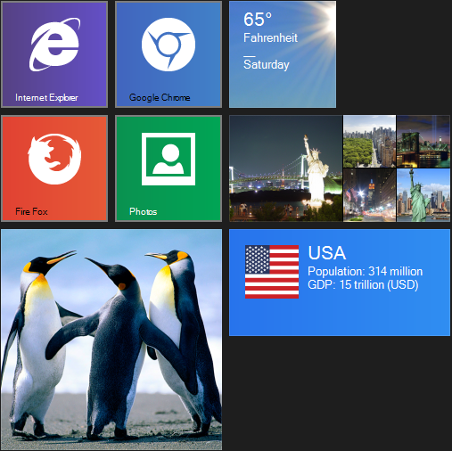
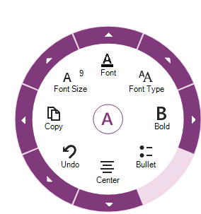
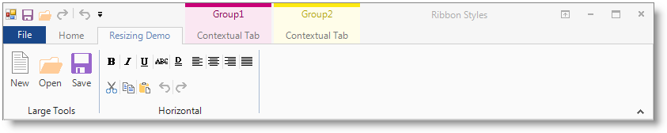

////

|metadata|
{
    "name": "whats-new-in-2013-volume-2",
    "controlName": [],
    "tags": [],
    "guid": "12838259-7b0c-42f9-80d4-5f591a7c38e6",  
    "buildFlags": [],
    "createdOn": "2013-09-20T18:46:44.6025427Z"
}
|metadata|
////

= What's New in 2013 Volume 2

=== Features Overview

The following table summarizes the new features of the Infragistics Windows Forms 2013 Volume 2. Additional details follow the table.

++++
<table cellspacing="0" cellpadding="0">
    <tbody>
        <tr>
            <th>
                
Control

            </th>

            <th>
                
Feature

            </th>

            <th>
                
Description

            </th>
        </tr>

        <tr>
            <td><a href="#_Ref366743382">WinLiveTileView</a>™</td>

            <td>
                
<a href="#_Ref366743417">New control</a>

            </td>

            <td>
                
The WinLiveTileView control is new to Infragistics Windows Forms family of controls in
                13.2. It provides similar appearance and behavior as the Windows 8 start screen tiles.

            </td>
        </tr>

        <tr>
            <td><a href="#_Ref366743425">WinRadialMenu</a>™</td>

            <td>
                
<a href="#_Ref366743642">New control</a>

            </td>

            <td>
                
The WinRadialMenu component is another addition to Infragistics Windows Forms family of
                components in 13.2. It provides similar functionality as the Microsoft OneNote MX 2013 radial menu.

            </td>
        </tr>

        <tr>
            <td><a href="#_Ref366743440">WinToolbarsManager</a>™</td>

            <td>
                
<a href="#_Ref366743451">Office2013 Ribbon style</a>

            </td>

            <td>
                
Extends the styling options in WinToolbarsManager’s ribbon control to the new
                Office 2013 Ribbon style.

            </td>
        </tr>

        <tr>
            <td><a href="#_Ref366743460">WinGrid</a>™</td>

            <td>
                
<a href="#_Ref366743481">Page breaks when printing</a>

            </td>

            <td>
                
Enables developers’ to insert page breaks on specified rows in print preview and print.

            </td>
        </tr>

        <tr>
            <td><a href="#_Ref366743500">WinTree</a>™</td>

            <td>
                
<a href="#_Ref366743509">Print preview and print</a>

            </td>

            <td>
                
Enables developers’ print preview and print functionalities for the WinTree.

            </td>
        </tr>

        <tr>
            <td>
                
<a href="touch-enabled-windesktopalert.html">WinDesktopAlert</a>™

            </td>

            <td rowspan="11">
                

                    <a href="WinTouchProvider.html" data-auto-update-caption="true">WinTouchProvider</a>
                

            </td>

            <td rowspan="11">
                
Implemented touch support and gestures to most of the controls in the list.

            </td>
        </tr>

        <tr>
            <td>
                
<a href="touch-enabled-winmessagebox.html">WinMessageBox</a>™

            </td>
        </tr>

        <tr>
            <td>
                
<a href="touch-enabled-schedule-controls.html#_Ref366599899">WinDayView</a>™

            </td>
        </tr>

        <tr>
            <td>
                
<a href="Touch-enabled-Schedule-Controls.html#_Ref366599947">WinMonthViewSingle</a>™

            </td>
        </tr>

        <tr>
            <td>
                
<a href="Touch-enabled-Schedule-Controls.html#_Ref366599969">WinMonthViewMuilti</a>™

            </td>
        </tr>

        <tr>
            <td>
                
<a href="Touch-enabled-Schedule-Controls.html#_Ref366600008">WinCalendarCombo</a>™

            </td>
        </tr>

        <tr>
            <td>
                
<a href="Touch-enabled-WinExplorerBar.html">WinExplorerBar</a>™

            </td>
        </tr>

        <tr>
            <td>
                
<a href="Touch-enabled-WinTimelineView.html">WinTimelineView</a>™

            </td>
        </tr>

        <tr>
            <td>
                
<a href="Touch-enabled-WinGanttView.html">WinGanttView</a>™

            </td>
        </tr>

        <tr>
            <td>
                
<a href="Touch-enabled-WinDockManager.html">WinDockManager</a>™

            </td>
        </tr>

        <tr>
            <td>
                
<a href="Touch-enabled-WinToolbarsManager-and-Ribbon.html">WinToolbarsManager</a>™

            </td>
        </tr>

        <tr>
            <td>
                
<a href="#_Ref366743522">Infragistics Document Engine</a>™

            </td>

            <td>
                
<a href="#_Ref366743578">Progress indicator</a>

            </td>

            <td>
                
The purpose of this feature is to provide the developers with information that would lead them to show the progress
                indicator in their applications. While documents are being saved.

            </td>
        </tr>
    </tbody>
</table> 
++++

[[_Ref366743382]]
== _WinLiveTileView_

[[_Ref366743417]]

=== New control

Built to emulating the look and feel of Microsoft Windows 8 start screen, The  _WinLiveTileView_   control fully supports touch gestures such as panning, zooming, and press-and-hold.

This control provides convenient ways to style the appearances of the groups, tiles and other visual elements, though the control’s designer interface and  _AppStylist_™.

Localization, another key feature of the  _WinLiveTileView_  , is similar to Microsoft Windows 8 tile paradigm dealing with localization. With this feature, you can Configure the tiles with a culture-specific name such as “`fr-FR`” (France) and provide localized content in that language that displays the content when the computer’s regional setting matches your configured culture-specific name.

==== Related Topic:

* link:winlivetileview.html[WinLiveTileView]

[[_Ref366743425]]
== _WinRadialMenu_

[[_Ref366743642]]

The  _WinRadialMenu_   component presents tools and functionalities like those of Microsoft’s  _OneNote MX 2013_   radial menu. It is compatible not only with Windows 8, but also with Windows 7 and Windows XP operating systems.

This component provides convenient ways to style the appearances of the tools using the component’s designer interface and  _AppStylist™_  .

An application with different functionalities and settings can display one or more  _WinRadialMenu_   components. It supports  *mouse* ,  *keyboard*  and  *touch*  interactions with touch-enabled monitor.

==== Related Topic:

* link:winradialmenu.html[WinRadialMenu]

[[_Ref366743440]]
== _WinToolbarsManager_

[[_Ref366743451]]

=== Office2013 Ribbon style

The  _WinToolbarsManager_   component already supports multiple view styles such as Office 2007, Office 2010, Scenic Ribbons, and more. Added in this feature is the new Office 2013 style, similar to Microsoft Office 2013 lates version of the ribbon. This implementation typically involves a style changes to the existing Ribbon architecture of the  _WinToolbarsManager_  .

==== Related Topic:

* link:wintoolbarsmanager-office-2013-ribbon-look-and-feel.html[Office 2013 Ribbon Look and Feel]

[[_Ref366743460]]
== _WinGrid_

[[_Ref366743481]]

=== Page breaks when printing

Extends the  _WinGrid_   control’s printing functionality to support page break option allowing the placement of page breaks on specified rows, or grouped rows, in print preview and print.

This enhancement does not change the existing behavior if there are no rows set to start a new page.

==== Related Topic:

* link:wingrid-page-break-when-printing.html[Page Break When Printing]

[[_Ref366743500]]
== _WinTree_

[[_Ref366743509]]

=== Print preview and print

The  _WinTree_   printing feature provides print preview and print functionalities allowing you to view and print the  _WinTree_   in any of its supported view styles, for example,  _Standard_  ,  _OutlookExpress_  ,  _Grid_   and  _FreeForm._

==== Related Topic:

* link:wintree-printing-wintree.html[Printing WinTree]

[[_Ref366743522]]
== _Infragistics Document Engine_

[[_Ref366743578]]

=== Progress indicator

Enhancements to the Infragistics Document Engine allow developers to retrieve information on PDF and XPS documents that are in the midst of the save process. Such information helps in displaying some progress indicator while executing the saving operation.

.Note:
[NOTE]
====
This feature only provides information about the progress; it is not a progress indicator control.
====

The developer needs to handle the link:{ApiPlatform}documents.reports.v{ProductVersion}~infragistics.documents.reports.report.report~reportpublishing_ev.html[ReportPublishing] event of the link:{ApiPlatform}documents.reports.v{ProductVersion}~infragistics.documents.reports.report.report_members.html[Report] object and use the parameters returned from the event to display a progress.

[options="header", cols="a,a"]
|====
|Parameter name|Description

|Percentage
|Calculated percentage of the total number of items that are in the midst of the save process saved.

|Total
|Calculated total number of items in the midst of the save process.

|Current
|Current object being saved.

|IsFinished
|Boolean value (`True`/`False`) indicates the end of the save operation.

|====

==== Related Topic:

* link:waw-infragistics-document-engine.html[Infragistics Document Engine]