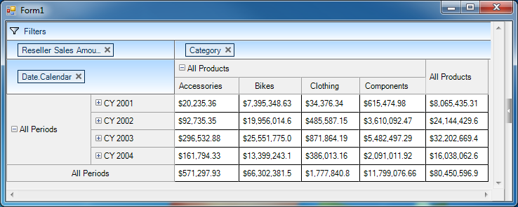
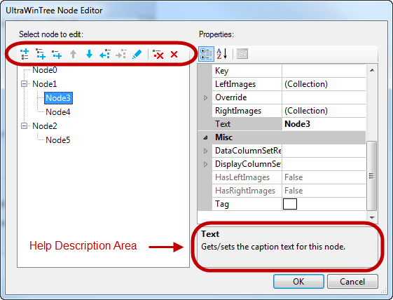

////

|metadata|
{
    "name": "whats-new-in-2014-volume-1",
    "controlName": [],
    "tags": [],
    "guid": "bbf97a74-9db5-43aa-986d-141528b967dc",  
    "buildFlags": [],
    "createdOn": "2014-01-29T18:20:44.1472239Z"
}
|metadata|
////

= What's New in 2014 Volume 1

== Topic Overview

=== Purpose

This topic presents the controls and the new and enhanced features for the Infragistics® Windows Forms 2014 Volume 1 release.

== What’s New Summary

=== What’s new summary chart

The following table summarizes what’s new in 2014 Volume 1. Additional details follow the summary table.

==== WinPivotGrid

[options="header", cols="a,a"]
|====
|Feature|Description

|<<_Ref382587830,New control>>
|Introducing _WinPivotGrid_ control as part of the Windows Forms® product in the 2014.1 release.

|====

==== Common Features

[options="header", cols="a,a"]
|====
|Feature|Description

|<<_Ref382587568,Right-to-Left Support>>
|This feature introduces Right-to-Left mode in the Infragistics editor controls’ displayed text and UI elements.

|<<_Ref382587624,Spin button acceleration>>
|Spin button provides capability to increase or decrease the value displayed in the editor.

|====

==== WinTab, WinTabStrip

[options="header", cols="a,a"]
|====
|Feature|Description

|<<_Ref382587852,Adding a New Tab button>>
|This feature allows developers to add a New Tab button, thereby making it convenient for users to add new tabs from the UI.

|====

==== WinToolbarsManager

[options="header", cols="a,a"]
|====
|Feature|Description

|<<_Ref382587855,Configurable tab item visibility>>
|This feature allows configuring the Ribbon tab items visibility.

|<<_Ref382587860,Prioritized tools’ visibility>>
|This feature allows the developer to configure the level of importance of frequently used tools. It provides the user the convenience of prioritizing and displaying more frequently used tools.

|====

==== WinCombo, WinComboEditor

[options="header", cols="a,a"]
|====
|Feature|Description

|<<_Ref382587774,Ignoring diacritics on Autocomplete>>
|This feature is implemented in both _WinCombo_ and _WinComboEditor_ controls allowing to perform search for an exact word ignoring diacritics.

|====

==== WinGrid

[options="header", cols="a,a"]
|====
|Feature|Description

|<<_Ref382587678,Disabling delete row confirmation>>
|You can now disable the confirmation dialog when the user attempts to delete a row.

|<<_Ref382587687,Configurable initial sort direction>>
|This feature provides the user with an option to apply a predefined sort order upon first user interaction.

|====

==== WinSpellChecker

[options="header", cols="a,a"]
|====
|Feature|Description

|<<_Ref382587845,Configurable spellchecker underline>>
|This feature allows adjusting the vertical offset of the underline that spellchecker scribes beneath misspelled words.

|====

==== WinTilePanel

[options="header", cols="a,a"]
|====
|Feature|Description

|<<_Ref382587868,Touch-enabled WinTilePanel>>
|Implemented touch support and gestures to _WinTilePanel_ control.

|====

==== WinTree

[options="header", cols="a,a"]
|====
|Feature|Description

|<<_Ref382587898,Node Editor Designer dialog>>
|The tree Node Designer dialog has been revamped giving the developers the convenience in creating and modifying tree nodes at design time.

|====

[[_Ref380501687]]
== _WinPivotGrid_

[[_Ref382587830]]

=== New control

Introducing  _WinPivotGrid_   control as part of the Windows Forms product in the 2014.1 release.

The  _WinPivotGrid_   control serves as an analytical tool for summarizing multidimensional (OLAP) data, typically for business applications.

==== Related topics:

* link:winpivotgrid.html[WinPivotGrid]

== Common Features

[[_Ref382587568]]

=== Right-to-Left Support

This feature allows configuring Right-to-Left mode in editor controls. It flips the control’s displayed text and UI elements across the line of symmetry, or axis of reflection, rendering a mirrored view of the control’s displayed text and UI elements, which usually displays in a Left-to-Right orientation.

==== Supported controls:

* _WinButton_

* _WinCalculatorDropDown_

* _WinCalendarCombo_

* _WinCheckEditor_

* _WinColorPicker_

* _WinCombo_

* _WinComboEditor_

* _WinCurrencyEditor_

* _WinDateTimeEditor_

* _WinDropDownButton_

* _WinFontNameEditor_

* _WinFormattedLinkLabel_

* _WinFormattedTextEditor_

* _WinLabel_

* _WinMaskedEdit_

* _WinNumericEditor_

* _WinOptionSet_

* _WinProgressBar_

* _WinScrollBar_

* _WinTextEditor_

* _WinTimeSpanEditor_

* _WinTimeZoneEditor_

* _WinTrackBar_

==== Related topics:

* link:right-to-left-support.html[Right-to-Left Support]

[[_Ref382587624]]

=== Spin button acceleration

Spin button acceleration allows speeding up the spinning iteration of the editor’s value when pressing and holding the spin button.

Implemented in the Infragistics editor controls this process allowing spin button acceleration. It also allows setting a threshold on the spin button indicating when to start the acceleration.

==== Supported controls:

* _WinCalculatorDropDown_

* _WinCalendarCombo_

* _WinColorPicker_

* _WinCombo_

* _WinComboEditor_

* _WinCurrencyEditor_

* _WinDateTimeEditor_

* _WinFontNameEditor_

* _WinFormattedTextEditor_

* _WinMaskedEdit_

* _WinNumericEditor_

* _WinTextEditor_

* _WinCalculatorDropDown_

* _WinTimeSpanEditor_

* _WinTimeZoneEditor_

==== Related topics:

* link:wineditors-configuring-the-spin-acceleration.html[Configuring the Spin Acceleration]

== _WinTab_  ,  _WinTabStrip_

[[_Ref382587852]]

=== Adding a New Tab button

Similar to the tabs found on contemporary browsers this feature allows users to add new tabs while the application is running.

==== Related topics:

* link:wintab-adding-new-tab-button.html[Adding New Tab Button]

== _WinToolbarsManager_

[[_Ref382587855]]

=== Configurable tab item visibility

This feature allows developers to configure the visibility of the Ribbon tab items by showing or hiding tab items. Hiding tab items also reduces the height of the ribbon area; reclaiming the remaining room.

==== Related topics:

* link:wintoolbarsmanager-configuring-ribbon-tab-item-visibility.html[Configuring Ribbon Tab Item Visibility]

[[_Ref382587860]]

=== Prioritized tools’ visibility

This feature introduces the tool’s priority property allowing tools to be prioritized whenever toolbar space is limited due to data usage. When there is not enough room for a toolbar to display all of its tools, the toolbar will sort the tools displaying more frequently used tools, and moving less frequently used tools to a bumped toolbar.

Each tool exposes a link:{ApiPlatform}win.ultrawintoolbars{ApiVersion}~infragistics.win.ultrawintoolbars.sharedprops~priority.html[Priority] property on the `SharedProps` object providing developers a way to specify the tool’s level of importance. Additionally, the  _UltraToolbarsManager_   keeps a counter of tool usage (known as usage data), which is also taken into consideration when sorting the tools.

The  _UltraToolbarsManager_   class exposes a new property link:{ApiPlatform}win.ultrawintoolbars{ApiVersion}~infragistics.win.ultrawintoolbars.ultratoolbarsmanager~toolsortingprecedence.html[ToolSortingPrecedence] allowing users to specify the priority taking precedence over the usage data.

== _WinCombo_,  _WinComboEditor_

[[_Ref382587774]]

=== Ignoring diacritics on Autocomplete

This feature provides the developer with the ability to ignore diacritics in search strings either including or excluding the words with diacritics or accent marks in searched result.

==== Related topics:

* link:wincomboeditor-ignoring-diacritics-on-autocomplete.html[Ignoring Diacritics on Autocomplete]

[[_Ref382519448]]
[[_Ref380501819]]
== _WinGrid_

[[_Ref382587678]]

=== Disabling delete row confirmation

This feature provides the developer with a new property for disabling the confirmation dialog when the user attempts to delete a row.

By default, when selecting and deleting a row from the  _WinGrid_  , prompts a confirmation dialog reconfirming the user’s intentions before deleting the row.

==== Related topics:

* link:wingrid-disabling-delete-row-confirmation.html[Disabling Delete Row Confirmation]

[[_Ref382587687]]

=== Configurable initial sort direction

This feature provides the user with an option to use a predefined sort order when the user attempts to sort unsorted column for the first time.

==== Related topics:

* link:wingrid-configuring-initial-sort-order.html[Configuring Initial Sort Order]

[[_Ref382428454]]

[[_Ref382519482]]

== _WinSpellChecker_

[[_Ref382587845]]

=== Configurable spellchecker underline

Configure the spellchecker underline using the link:{ApiPlatform}win.ultrawinspellchecker{ApiVersion}~infragistics.win.ultrawinspellchecker.ultraspellchecker~underlineverticaloffset.html[UnderlineVerticalOffset] property, which accepts positive and negative integer values for setting the vertical offset for the underline positioned beneath misspelled words.

==== Related topics:

* link:winspellchecker-offsetting-the-spellchecker-underline.html[Offsetting the SpellChecker Underline]

[[_Ref382519521]]

== _WinTilePanel_

[[_Ref382587868]]

=== Touch enabled WinTilePanel

Implemented touch support and gestures to the  _WinTilePanel_   control.

==== Related topics:

* link:touch-enabled-wintilepanel.html[Touch-enabled WinTilePanel]

[[_Ref382519534]]

[[_Ref382519548]]

== _WinTree_

[[_Ref382587898]]

=== New Node Editor Designer dialog

As in modern UIs, the new Designer Dialog presents icon buttons on top of the dialog, for creating and modifying the tree nodes. The dialog includes a descriptions area for the properties where developers can see vital information about the properties during design time.

Drag-and-Drop capability is available on the designer dialog to reposition nodes. The buttons change their enabled state based on the tree structure and node selection.

==== Related topics:

* link:wintree.html[WinTree]

=== Synchronized nodes’ checkboxes

This feature provides the ability to synchronize the checkboxes automatically so that a parent node will show as being in checked, unchecked or indeterminate states based on the checked state of its child nodes.

==== Related topics:

* link:wintree-synchronizing-check-boxes-of-the-tree-nodes.html[Synchronizing Check Boxes of the Tree Nodes]