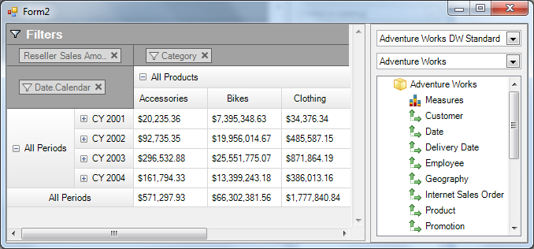
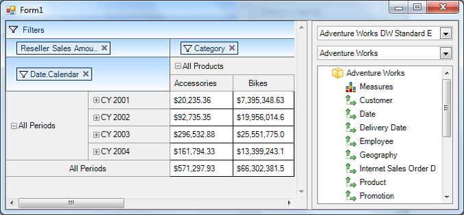

////

|metadata|
{
    "name": "whats-new-in-2014-volume-2",
    "controlName": [],
    "tags": [],
    "guid": "d7d4fa6d-bbf9-486d-a9e4-a4d70ca645f2",  
    "buildFlags": [],
    "createdOn": "2014-04-03T20:30:48.541205Z"
}
|metadata|
////

= What's New in 2014 Volume 2

== Topic Overview

=== Purpose

This topic presents the controls and the new and enhanced features for the Infragistics® Windows Forms 2014 Volume 2 release.

== What’s New Summary

=== What’s new summary chart

The following table summarizes what’s new in 2014 Volume 2. Additional details follow the summary table.

== WinCarousel

[options="header", cols="a,a"]
|====
|Feature|Description

|<<_Ref382587830,New control>>
|Introducing _WinCarousel_ control as part of the Windows Forms® product in the 2014.2 release.

|====

== UltraDataChart

[options="header", cols="a,a"]
|====
|Feature|Description

|<<_Ref382587835,New control>>
|Introducing _UltraDataChart_ control as part of the Windows Forms® product in the 2014.2 release.

|====

== WinPivotGrid

[options="header", cols="a,a"]
|====
|Feature|Description

|<<_Ref382587840,FlatDataSource>>
|This feature introduces _FlatDataSource_ type object for the _WinPivotGrid_ control in addition to XMLA and ADOMD data providers.

|<<_Ref382587845,Compact / SuperCompact Views>>
|This feature allows to configure the row header layout with available options such as: Compact and SuperCompact, and Standard views.

|<<_Ref382587850,Default Theme>>
|This feature illustrates the new default appearance (Theme) of the WinPivotGrid control.

|====

== WinGrid

[options="header", cols="a,a"]
|====
|Feature|Description

|<<_Ref382587855,Right-to-Left Support>>
|This feature introduces Right-to-Left mode in the Infragistics controls’ displayed text and UI elements.

|====

== _WinCarousel_

[[_Ref382587830]]

=== New control

Introducing  _WinCarousel_   control as part of the Windows Forms product in the 2014.2 release.

The  _WinCarousel_   is a navigation control that displays a list of items in form of rectangular tiles along a predefined path. Each item may present a text or an image.

==== Related topics:

* link:wincarousel.html[WinCarousel]

== _UltraDataChart_

[[_Ref382587835]]

Introducing  _UltraDataChart_   control as part of the Windows Forms product in the 2014.2 release.

The  _UltraDataChart_   is a data visualization control, modeled from the Infragistics WPF  _XamDataChart_   control.

==== Related topics:

* link:datachart-datachart.html[UltraDataChart]

== _WinPivotGrid_

[[_Ref382587840]]

=== FlatDataSource

In addition to the  _XmlaDataSource_   and  _AdomdDataSource_   data providers, which obtain their respective schemas from the OLAP server, the  _FlatDataSource_   simulates the OLAP experience using 2-dimensioanl data.

== Related topics:

* link:winpivotgrid-using-flatdatasource.html[Using FlatDataSource]

[[_Ref382587845]]

=== Compact / SuperCompact views

The WinPivotGrid now provides additional row header layout options (Compact and SuperCompact). This allows to organize the row headers by freeing unused space from the row header area where applicable, and allocate it for presenting data.

==== Available row layout options are:

*  _Compact_   – Child headers are superimposed over their parent row headers.
*  _Standard_   – Each level appears as a separate column in the layout.
*  _SuperCompact_   – All headers occupy only one logical column.

*In C#:*

[source,csharp]
----
ultraPivotGrid1.RowHeaderLayout = Infragistics.Win.UltraWinPivotGrid.RowHeaderLayout.Compact;
----

*In Visual Basic:*

[source,vb]
----
ultraPivotGrid1.RowHeaderLayout = Infragistics.Win.UltraWinPivotGrid.RowHeaderLayout.Compact
----

[[_Ref382587850]]

=== Default Theme

A new default theme has been implemented for the WinPivotGrid control. The following two screenshots illustrate the differences between the new and older version of appearances.

New appearance (2014.2).

Old appearance (2014.1).

== _WinGrid_

[[_Ref382587855]]

=== Right-to-Left Support

The Right-to-Left mode in the  _WinGrid_   applies to the columns and cell content. Both columns and cell contents displayed with symmetric reflection, rendering a mirrored view.

==== Related topics:

* link:right-to-left-support.html#_Ref377393490[Right-to-Left Support]