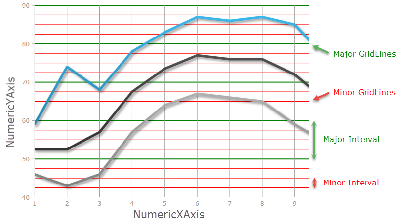
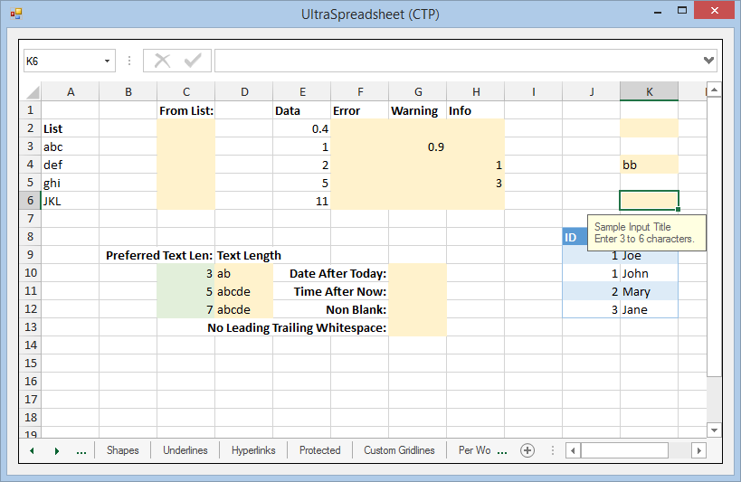

////
|metadata|
{
    "name": "whats-new-in-2015-volume-2",
    "controlName": [],
    "tags": [],
    "guid": "a715d375-738c-4326-b253-e8a384ddc934",
    "buildFlags": [],
    "createdOn": "2015-07-13T15:04:52.2879592Z"
}
|metadata|
////

= What's New in 2015 Volume 2

== Topic Overview

=== Purpose

This topic provides detailed instruction on the controls and new and enhanced features for Infragistics® Windows Forms® 2015 Volume 2 release.

[[_Ref386478097]]
[[_Configuring_a_Custom]]
== What’s New Summary

=== What’s New Summary Chart

[options="header", cols="a,a"]
|====
|Feature|Component

|
* <<Intervals,Axis Intervals (Major/Minor Gridlines)>> 

* <<AnnotationLayer,Annotation Layer>> 

* <<BubbleSeries,Bubble Series>> 

* <<PolarSeries,Polar Series>> 

* <<RadialSeries,Radial Series>> 

* <<StackedSeries,Stacked Series>> 

* <<CategoryAngleAxis,Category Angle Axis>> 

* <<NumericAngleAxis,Numeric Angle Axis>> 

* <<NumericRadiusAxis,Numeric Radius Axis>> 

* <<CategoryTooltipLayer,Category Tooltip Layer>> 

* <<ItemTooltipLayer,Item Tooltip Layer>> 

* <<CategoryHighlightLayer,Category Highlight Layer>> 

* <<CategoryItemHighlightLayer,Category Item Highlight Layer>> 

* <<CrosshairLayer,Crosshair Layer>> 

* <<SaveTo,SaveTo (ImageType)>> 

* <<ScaleLegend,Scale Legend>> 

* <<TouchGesture,Touch Gestures>> 

* <<ValueOverlay,Value Overlay>> 

|UltraDataChart

|<<Subscript_SuperScript,Subscript and Superscript formatting>>
|UltraFormattedTextEditor and UltraFormattedLinkLabel

|<<StartPositionStartLocation,StartPosition and StartLocation properties>>
|UltraMessageBoxInfo

|<<MinSummaryRowHeight_DefaultSummaryRowHeight,MinSummaryRowHeight and DefaultSummaryRowHeight properties>>
|UltraGrid

|<<NotificationBadges,Notification Badges>>
|UltraToolbarsManager

|<<FlatDataSource_DataAdapter,FlatDataSource DataAdapter classes>>
|UltraPivotGrid

|<<Spreadsheet,New Control>>
|Spreadsheet (CTP)

|====

== _UltraDataChart_

[[Intervals]]
=== Major and Minor Axis Intervals

The  _DataChartView's now supports both Major and Minor intervals which are displayed perpendicular to its axes_  .

The following screenshot displays a major interval on the NumericYAxis, using major interval value of 10, with a green stroke; and a minor interval on the NumericYAxis, using minor interval value of 2.5, with a red stroke.

==== Related topic:

* link:datachart-configuring-major-and-minor-intervals.html[Configuring Major and Minor Intervals]

[[SaveTo]]

=== Saving the Chart

This topic describes how to use the SaveTo method of the element to save an image of the UltraDataChart

==== Related topic:

* link:datachart-saving-a-chart-to-an-image.html[Using the SaveTo method]

[[ScaleLegend]]

=== Scale Legend

This topic describes how to use the Scale Legend for the UltraDataChart

==== Related topic:

* link:datachart-legends.html#Legends[Scale Legend]

[[BubbleSeries]]

=== Bubble Series

This topic explains how to use the Bubble Series in the UltraDataChart

==== Related topic:

* link:datachart-bubble-series.html[Scatter Bubble Series]

[[StackedSeries]]

=== Stacked Series

This topic explains how to use the Stacked Series in the UltraDataChart

==== Related topics:

* link:datachart-category-stacked-spline-series.html[Stacked Spline Series]
* link:datachart-category-stacked-spline-area-series.html[Stacked Spline Area Series]
* link:datachart-category-stacked-line-series.html[Stacked Line Series]
* link:datachart-category-stacked-column-series.html[Stacked Column Series]
* link:datachart-category-stacked-bar-series.html[Stacked Bar Series]
* link:datachart-category-stacked-area-series.html[Stacked Area Series]
* link:datachart-category-stacked-100-area-series.html[Stacked 100-Area Series]
* link:datachart-category-stacked-100-bar-series.html[Stacked 100-Bar Series]
* link:datachart-category-stacked-100-column-series.html[Stacked 100-Column Series]
* link:datachart-category-stacked-100-line-series.html[Stacked 100-Line Series]
* link:datachart-category-stacked-100-spline-area-series.html[Stacked 100-Spline Area Series]
* link:datachart-category-stacked-100-spline-series.html[Stacked 100-Spline Series]

[[PolarSeries]]

=== Polar Series

This topic explains the common properties for the Polar Series in the UltraDataChart

==== Related topic:

* link:datachart-polar-series-overview.html[Polar Series Overview]

[[RadialSeries]]

=== Radial Series

This topic explains the common properties for the Radial Series in the UltraDataChart

==== Related topic:

* link:datachart-radial-series-overview.html[Radial Series Overview]

[[NumericAngleAxis]]

=== Numeric Angle Axis

This topic demonstrates how to use the Numeric Angle Axis in the UltraDataChart

==== Related topic:

* link:datachart-using-numeric-angle-axis.html[Using Numeric Angle Axis]

[[CategoryAngleAxis]]

=== Category Angle Axis

This topic demonstrates how to use the Category Angle Axis in the UltraDataChart

==== Related topic:

* link:datachart-using-category-angle-axis.html[Using Category Angle Axes]

[[NumericRadiusAxis]]

=== Numeric Radius Axis

This topic describes how to use the Numeric Radious Axis in the UltraDataChart

==== Related topic:

* link:datachart-using-numeric-radius-axis.html[Using Numeric Radius Axis]

[[TouchGesture]]

=== Touch Gesture Support

This topic describes how to use the Numeric Radious Axis in the UltraDataChart

==== Related topic:

* link:datachart-navigating-chart-using-touch-gestures.html[Navigating Chart Using Touch Gestures]

[[AnnotationLayer]]

=== Annotation Layer

This topic provides conceptural information about the annotations andhover interactions available on the UltraDataChart

==== Related topic:

* link:datachart-chartannotationlayers.html[Chart Annotation Layers]

[[CategoryTooltipLayer]]

=== Category Tooltip Layer

This topic provides information about the category tooltip layer used for hover interactions available on the DataChart

==== Related topic:

* link:datachart-categorytooltiplayer.html[Category Tooltip Layer]

[[ItemTooltipLayer]]

=== Item Tooltip Layer

This topic provides information about the item tooltip layer used for hover interactions available on the DataChart

==== Related topic:

* link:datachart-itemtooltiplayer.html[Item Tooltip Layer]

[[CrosshairLayer]]

=== Crosshair Layer

This topic provides information about the crosshair layer used for hover interactions available on the DataChart

==== Related topic:

* link:datachart-crosshairlayer.html[Crosshair Layer]

[[CategoryHighlightLayer]]

=== Category Highlight Layer

This topic provides information about the category highlight layer used for hover interactions available on the DataChart

==== Related topic:

* link:datachart-categoryhighlightlayer.html[Category Highlight Layer]

[[CategoryItemHighlightLayer]]

=== Category Item Highlight Layer

This topic provides information about the category item highlight layer used for hover interactions available on the DataChart

==== Related topic:

* link:datachart-categoryitemhighlightlayer.html[Category Item Highlight Layer]

[[ValueOverlay]]

=== Value Overlay

This topic introduces the Value Overlay feature of the DataChart

==== Related topic:

* link:datachart-series-value-overlay.html[Value Overlay]

== _FormattedTextEditor & FormattedLinkLabel_

[[Subscript_SuperScript]]

=== Using Subscript and Superscript

This topic provides a conceptual overview of how to use subscript and superscript formatting in the FormattedTextEditor or FormattedLinkLabel controls.

==== Related topic:

* link:formattedtexteditor-using-subscript-and-superscript.html[Using Subscript and Superscript]

== _UltraMessageBoxInfo_

[[StartPositionStartLocation]]

=== StartPosition and StartLocation

This topic demonstrates the usage of the StartPosition and StartLocation properties for the UltraMessageBoxInfo control.

==== Related topic:

* link:winmessageboxmanager-setting-up-the-startposition-and-startlocation-properties.html[Setting up the StartPosition and StartLocation properties]

== _UltraWinGrid_

[[MinSummaryRowHeight_DefaultSummaryRowHeight]]

=== New Summary Properties

This topic demonstrates the usage of the MinSummaryRowHeight and DefaultSummaryRowHeight properties of the UltraGrid.

==== Related topic:

* link:wingrid-using-the-minsummaryrowheight-and-defaultsummaryrowheight.html[Using the MinSummaryRowHeight and DefaultSummaryRowHeight]

== _UltraToolbarsManager_

[[NotificationBadges]]

=== Notification Badge

This topic demonstrates the usage of the new NotificationBadges feature for the UltraToolbarsManager

==== Related topic:

* link:wintoolbarsmanager-using-the-notification-badge.html[WinToolbarsManager Using the Notification Badge]

== _UltraPivotGrid_

[[FlatDataSource_DataAdapter]]

=== FlatDataSource DataAdapters

This topic describes how to use the FlatDataSource Data Adapters to bind to the WinPivotGrid

==== Related topic:

* link:winpivotgrid-using-the-flatdatasource-dataadapter-classes.html[Using the FlatDataSource DataAdapter classes]

== _SpreadSheet (CTP)_

[[Spreadsheet]]

=== New Control

The Spreadsheet control allows visualizing and editing of spreadsheet data, represented by the data model supported by the Infragistics Excel Engine. The following screenshot shows the Spreadsheet control displaying some spreadsheet data:

==== Assembly

* link:{ApiPlatform}win.ultrawinspreadsheet.v{ProductVersion}.html[Infragistics4.Win.UltraWinSpreadsheet.v15.2 Assembly]