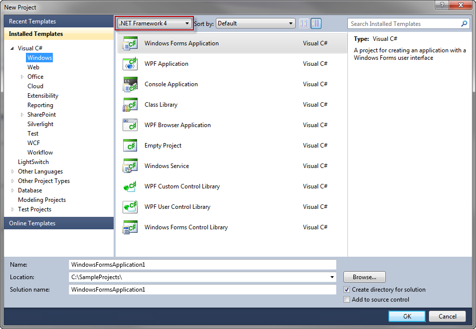

////

|metadata|
{
    "name": "whats-new-new-clr4-builds-of-winforms-assemblies",
    "controlName": [],
    "tags": ["Application Blocks","Getting Started","How Do I"],
    "guid": "255bc99c-5d3a-45fd-aec2-6f09b1a63f57",  
    "buildFlags": [],
    "createdOn": "2011-08-04T13:46:20.6078662Z"
}
|metadata|
////

= New CLR4 Builds of WinForms Assemblies

With the 2011 Volume 2 release of Infragistics Windows Forms, your solutions can run the latest version of the CLR4 framework and take advantage of our assemblies using the same CLR version.

== Creating a New Windows Forms Application with CLR4

To create an application with CLR4, when creating a new project in Visual Studio, be sure to select .NET Framework 4 options, as shown in Figure 1 below.

(New Project dialog > framework selection drop-down (at the top-left of the middle pane) > .NET Framework 4)

Figure 1: Selecting .NET Framework 4 in the New Project dialog of Visual Studio 2010

When you drag one of the Infragistics controls to the form in Design View, Visual Studio will automatically use the proper CLR build of the referenced assembly.

== Additional Resources

Information about the new features in CLR4 from Microsoft can be found on this MSDN article:

link:http://msdn.microsoft.com/en-us/library/ms171868.aspx[http://msdn.microsoft.com/en-us/library/ms171868.aspx]

== Related Topics

* link:whats-new-in-2011-volume-2.html[What's New in 2011 Volume 2]