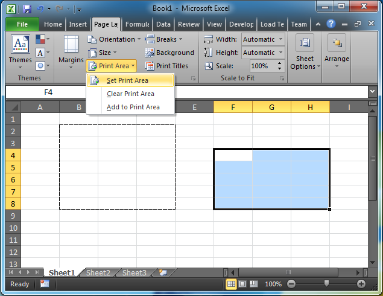
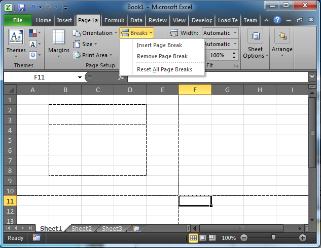
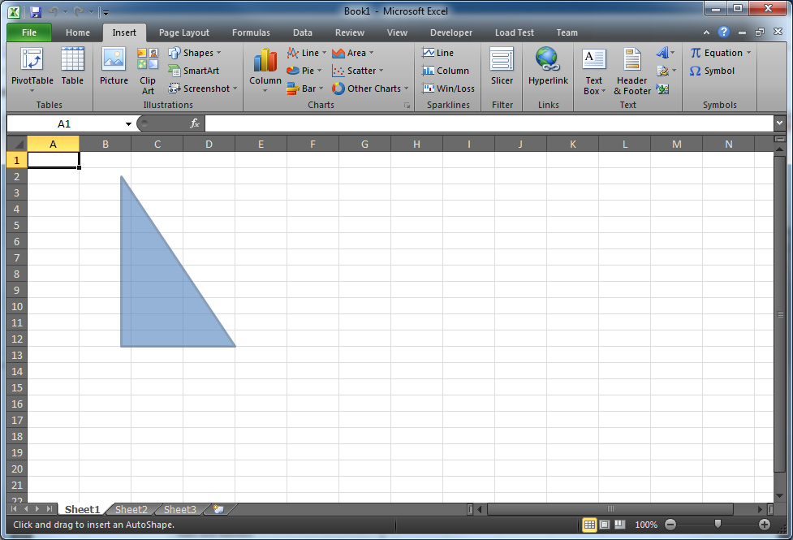

////

|metadata|
{
    "name": "whats-new-new-excel-additions-data-validations-print-areas-page-breaks-print-titles-and-shapes-support",
    "controlName": [],
    "tags": ["Application Blocks","Extending","Validation"],
    "guid": "b511e040-fab5-4aae-9b88-6b8a130413c2",  
    "buildFlags": [],
    "createdOn": "2011-10-03T17:26:34.0646958Z"
}
|metadata|
////

= New Excel Additions: Data Validations, Print Areas, Page Breaks, Print Titles, and Shapes Support

Starting with 2011 Volume 2 of Infragistics Windows Forms, several new additions to the Infragistics Excel Library are now available. The new features include data validation, print areas, page breaks, print titles, and predefined shapes.

== Excel Additions

The table below briefly explains the Infragistics Excel Engine additions.

[options="header", cols="a,a"]
|====
|Feature|Description

|<<One,Data Validation>>
|Verifying user entered data based on specific requirements before committing the value.

|<<Two,Print Areas>>
|Rectangular regions that no not overlap and act as print areas. Each separate area appears on its own page.

|<<Three,Page Breaks>>
|Vertical or horizontal page breaks that define a print boundary on a worksheet.

|<<Four,Print Titles>>
|Contiguous set of rows and/or columns to be repeated on each printed page.

|<<Five,Predefined Shapes>>
|Worksheet shape creation from a predefined list of shapes; diamond, ellipse, heart, irregular seal 1, irregular seal 2, lightning bolt, line, pentagon, rectangle, right triangle, and straight connector.

|====

[[One]]
== Data Validation

Data validation is the process of verifying user entered data based on specific requirements before committing the value. The new feature in our Infragistics Excel Engine takes advantage of this Excel functionality and allows you to set validation rules on worksheets, individual cells, or even multiple cells. Using data validation is useful when you want users to enter data that needs to stay within a specified criterion.

== Related Topics

* link:excelengine-datavalidation.html[Data Validation]

[[Two]]
== Print Areas

Print areas are non-overlapping rectangular regions of the worksheet that define printable sections of a sheet which print on their own page. Print areas are useful when you want to define a region of cells to print on a single page for a more organized print out.

Figure 1: Microsoft Excel demonstrating a print area inside the dashed lines.

== Related Topics

* link:excelengine-print-areas.html[Print Areas]

[[Three]]
== Page Breaks

Page breaks allow you to create vertical or horizontal page breaks that define a print boundary on a worksheet. Using vertical and horizontal page breaks are useful when you want to create separations in columns and rows to act as print boundaries separating different sections of your data during the printing process.

Figure 2: Microsoft Excel demonstrating vertical and horizontal breaks.

== Related Topics

* link:excelengine-page-breaks.html[Page Breaks]

[[Four]]
== Print Titles

Print titles allow you to designate a contiguous set of rows and/or columns that repeated on each printed page. Using print titles are useful when you want each new page to start with your designated set of rows and/or columns.

== Related Topics

* link:excelengine-print-titles.html[Print Titles]

[[Five]]
== Predefined Shapes

Using predefined shapes adds to the existing shape support by allowing you to create more shape types. These predefined shapes include: diamond, ellipse, heart, irregular seal 1, irregular seal 2, lightning bolt, line, pentagon, rectangle, right triangle, and straight connector.

Figure 3: Microsoft Excel worksheet containing the predefined shape, right triangle.

== Related Topics

* link:excelengine-using-predefined-shapes.html[Using Predefined Shapes]
* link:excelengine-creating-a-predefined-shape.html[Creating a Predefined Shape]