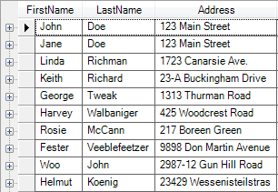
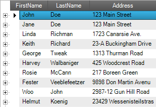
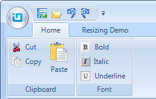
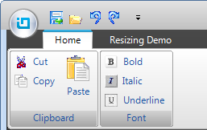

////

|metadata|
{
    "name": "whats-new-new-ig-styleset",
    "controlName": [],
    "tags": ["How Do I","Styling","Theming"],
    "guid": "105a0753-06bd-495f-8440-54c75932214d",  
    "buildFlags": [],
    "createdOn": "2011-05-13T18:00:45.9456752Z"
}
|metadata|
////

= New IG StyleSet

== New IG Theme in 2011 Volume 1

This release introduces a new theme – the IG Theme – that can be applied to all controls in Infragistics Windows Forms. This theme is dominantly monochromatic with the use of blacks, whites and some grays, with blue as a highlight/accent color.

The theme is implemented through the IG StyleSet which is stored in the IG.isl file residing at the product installed path C:\Users\Public\Documents\Infragistics\Infragistics 2011.1\Windows Forms\AppStylist for Windows Forms\Styles. To use this new StyleSet, load the IG.isl file into your application, using the link:{ApiPlatform}win.v{ProductVersion}~infragistics.win.appstyling.stylemanager~load.html[Load] method of the link:{ApiPlatform}win.v{ProductVersion}~infragistics.win.appstyling.stylemanager.html[StyleManager] class. This will apply the IG theme to the entire application. For more information on how apply themes to controls, refer to the link:styling-guide-loading-a-stylelibrary.html[Loading a Style Library] topic.

Figure 1 and Figure 2 below demonstrate the WinGrid control without and with the IG theme applied:

====== Figure 1: The WinGrid control without the IG theme applied

====== Figure 2: The WinGrid control with the IG theme applied

Figure 3 and Figure 4 below demonstrate the Ribbon of WinToolbarsManager component without and with the IG theme applied:

====== Figure 3: The Ribbon of WinToolbarsManager component without the IG theme applied

====== Figure 4: The Ribbon of WinToolbarsManager component with the IG theme applied