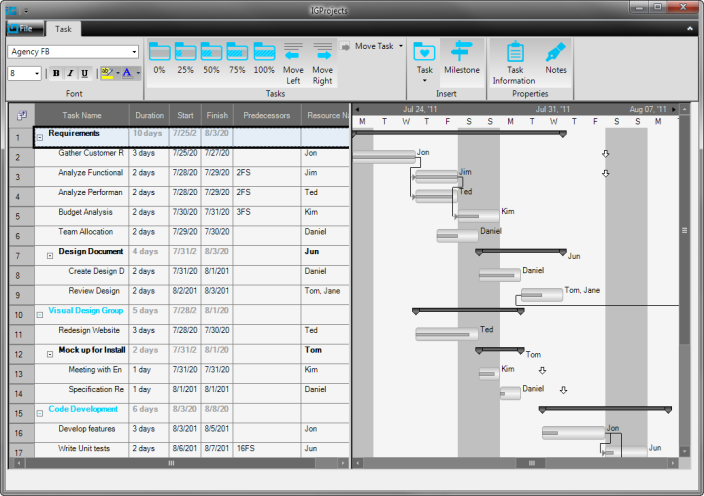

////

|metadata|
{
    "name": "whats-new-new-office-2010-black-and-silver-style-libraries",
    "controlName": [],
    "tags": ["Styling","Theming"],
    "guid": "81ba5365-037a-41cc-8f44-593886dce4ed",  
    "buildFlags": [],
    "createdOn": "2011-08-04T13:48:46.5438662Z"
}
|metadata|
////

= New Office 2010 Black and Silver Style Libraries

With this release of Infragistics Windows Forms, your application can get the Black or Silver Microsoft Office® 2010 look-and-feel. Two new styles, Office 2010 Black and Office 2010 Silver, have been added to our Style Library. You can take advantage of these new styles by loading the StyleSet (ISL file) in your application, and using the link:{ApiPlatform}win.v{ProductVersion}~infragistics.win.appstyling.stylemanager~load(string).html[Load] method of the link:{ApiPlatform}win.v{ProductVersion}~infragistics.win.appstyling.stylemanager.html[StyleManager] class.

== Office 2010 Black

Figure 1: IGProjects showcase sample using the Office 2010 Black ISL style

== Office 2010 Silver

Figure 2: IGProjects showcase sample using the Office 2010 Silver ISL style

== Related Topic

* link:styling-guide-loading-a-stylelibrary.html[Loading a Style Library]