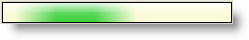

////

|metadata|
{
    "name": "whats-new-new-winactivityindicator-control",
    "controlName": [],
    "tags": [],
    "guid": "{B1525F3D-12F4-4612-8697-5F38FD6FADAB}",  
    "buildFlags": [],
    "createdOn": "0001-01-01T00:00:00Z"
}
|metadata|
////

= New WinActivityIndicator Control

The new WinActivityIndicator™ control provides a means to inform end users about a background process that might be time consuming. Time-consuming operations like downloads and database transactions can cause your user interface (UI) to seem as though it has stopped responding while they are running. The WinActivityIndicator can serve as an interactive user interface to indicate that a process is happening behind the scene.

WinActivityIndicator is a lightweight control that provides activity-indicator functionality along with being easily customizable and having style options (AppStyling and Appearance objects) similar to all other Infragistics controls.

== Related Topics

* link:winactivityindicator-understanding-winactivityindicator.html[Understanding WinActivityIndicator]
* link:winactivityindicator-using-winactivityindicator.html[Using WinActivityIndicator]