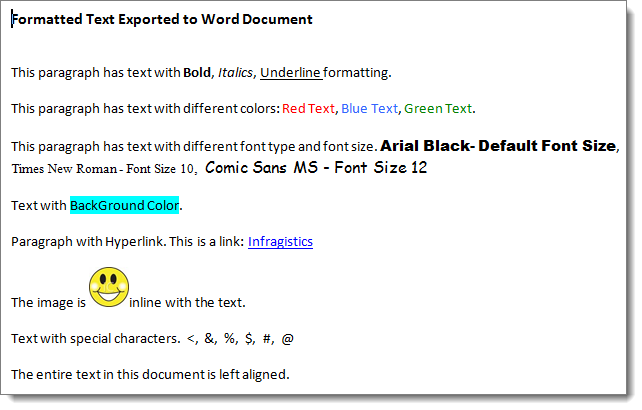

////

|metadata|
{
    "name": "whats-new-new winformattedtextwordwriter",
    "controlName": [],
    "tags": ["Exporting","Formatting"],
    "guid": "d5736e50-5c97-480b-a571-133ce3674a14",  
    "buildFlags": [],
    "createdOn": "2011-05-13T15:11:21.6596752Z"
}
|metadata|
////

= New WinFormattedTextWordWriter

This release of Infragistics Windows Forms 2011 Volume 1 introduces a new component – WinFormattedTextWordWriter™ . This component enables you to write the content of a WinFormattedTextEditor™ and WinFormattedLinkLabel™ to a new Word document. With the new link:{ApiPlatform}documents.io{ApiVersion}~infragistics.documents.word.worddocumentwriter.html[WordDocumentWriter] object of the Infragistics.Documents.IO assembly, the text is exported together with its formatting like font styles, font size, text alignment, images, hyperlinks, special characters, and the other formatted text features supported by the WinFormattedTextEditor and WinFormattedLinkLabel controls. (Figure 1)

Figure 1: Formatted text as exported from WinFormattedTextEditor to Word Document

== Related Topics

* link:winformattedtextwordwriter-about-winformattedtextwordwriter.html[About WinFormattedTextWordWriter]
* link:winformattedtextwordwriter-export-formattedtexteditor-text-to-word.html[Exporting FormattedTextEditor text to Word]