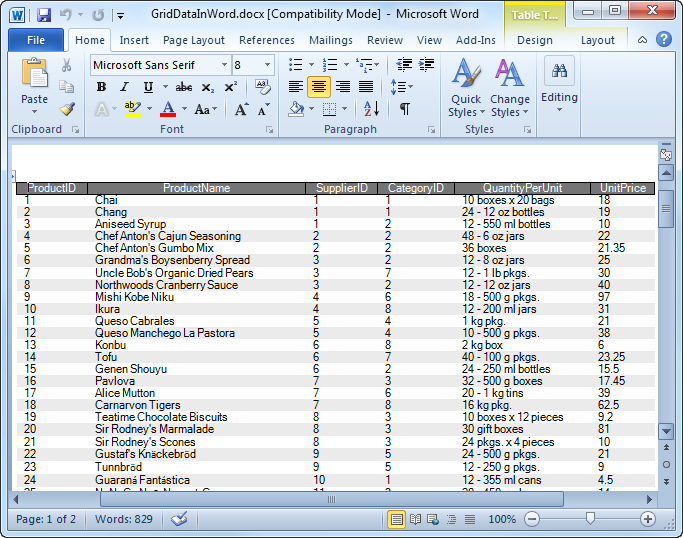

////

|metadata|
{
    "name": "whats-new-new-wingridwordwriter",
    "controlName": [],
    "tags": ["Exporting","Getting Started","Grids"],
    "guid": "09ae0759-3acc-4658-af47-5025e9a1531a",  
    "buildFlags": [],
    "createdOn": "2011-05-13T15:36:26.0816752Z"
}
|metadata|
////

= New WinGridWordWriter

This release of Infragistics Windows Forms 2011 Volume 1 introduces a new component called WinGridWordWriter™. This component allows you to export a WinGrid™ to a new Word document, based on the new link:infragistics4.documents.io.v{ProductVersion}~infragistics.documents.word.worddocumentwriter.html[WordDocumentWriter] object within the Infragisitcs.Documents.IO assembly. You can also export multiple WinGrid controls, as well as additional content such as paragraphs, images etc... With the WordDocumentWriter object, the UltraWinGrid control is directly exported to a file without creating the document in memory through the forward-only streamer approach. This approach is advantageous because in it the process uses significantly less RAM thus helping avoid the memory issues caused by exporting large data sets. The link:infragistics4.win.ultrawingrid.wordwriter.v{ProductVersion}~infragistics.win.ultrawingrid.wordwriter.ultragridwordwriter~export.html[Export] method of the WinGridWordWriter accepts as overloads both the WinGrid control being exported and either the stream or a WordDocumentWriter object.

Figure 1: WinGrid as exported to Word

== Related Topics

* link:wingridwordwriter-about-wingridwordwriter.html[About WinGridWordWriter]
* link:wingridwordwriter-export-multiple-wingrid-to-word.html[Exporting Multiple WinGrids to Word]
* link:wingridwordwriter-export-wingrid-with-paragraphs-to-word.html[Exporting WinGrid with Paragraphs to Word]