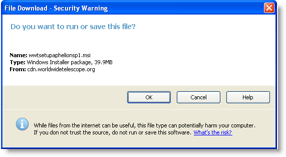

////

|metadata|
{
    "name": "whats-new-new-winmessageboxmanager-component",
    "controlName": [],
    "tags": [],
    "guid": "{1EDECFBC-5C6F-4993-9DD2-EC21F3CDFE3B}",  
    "buildFlags": [],
    "createdOn": "0001-01-01T00:00:00Z"
}
|metadata|
////

= New WinMessageBoxManager Component

The WinMessageBoxManager™ component provides a way to display application-specific and informational messages using a modal dialog box with styling and customization options. Unlike the standard .NET MessageBox dialog, the dialog window of WinMessageBoxManager and the text displayed within this dialog window can be formatted with the formatting capabilities available through the WinFormattedTextEditor™ and styled using Appearance objects and Infragistics AppStyling.

== Related Topic

* link:winmessageboxmanager.html[Understanding WinMessageBoxManager]