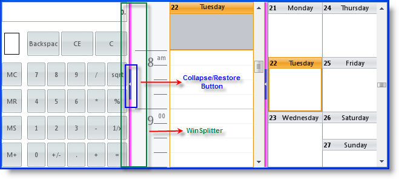

////

|metadata|
{
    "name": "whats-new-new-winsplitter-control",
    "controlName": [],
    "tags": [],
    "guid": "{743F06B7-DE88-4F6F-B0F5-5198B0D1FB43}",  
    "buildFlags": [],
    "createdOn": "2009-11-12T11:38:53Z"
}
|metadata|
////

= New WinSplitter Control

The WinSplitter™ control can be used to resize docked controls at run time. It is best suited for forms with controls that have varying lengths of data to present. One of the cool features of this control is the ability to collapse and restore the control being split, using the collapse/restore button available on the control. You can style the WinSplitter control like any other Infragistics Windows Forms suite of controls using Appearance objects and AppStyling.

== Related Topics

* link:winsplitter-understanding-winsplitter.html[Understanding WinSplitter]
* link:winsplitter-getting-started-with-winsplitter.html[Getting Started with WinSplitter]
* link:winsplitter-using-winsplitter.html[Using WinSplitter]