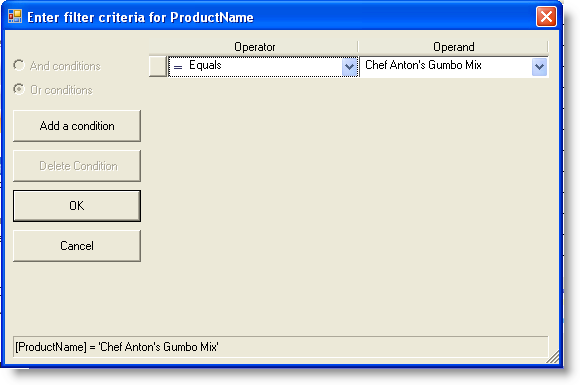
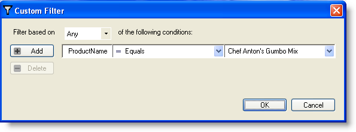
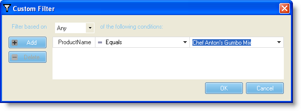
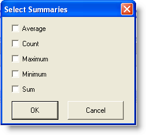
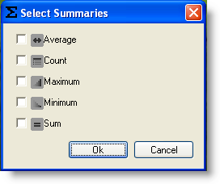
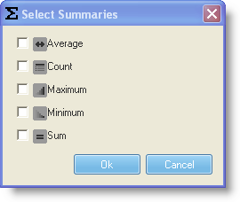

////

|metadata|
{
    "name": "whats-new-restyled-run-time-dialogs",
    "controlName": [],
    "tags": [],
    "guid": "f4e67c49-376c-48f4-9643-e22cc4766a66",  
    "buildFlags": [],
    "createdOn": "2010-06-02T16:11:58.0112809Z"
}
|metadata|
////

= Restyled Run-Time Dialogs

We have redesigned some of our run-time dialogs by changing their layout, modifying controls on the dialogs and applying more styling. With these new changes you can now match the run-time dialogs with the rest of your application, when Infragistics Application styling is applied. The following run-time dialogs have been modified:

WinGrid™ - Summary Dialog, CustomRowFilter Dialog (New reference – Infragistics4.Win.Misc)

WinPrintPreviewDialog™ - UltraStatusPrintDialog

WinToolBarsManager™ - CustomizeDialog, CustomizeDialogAddCommand, CustomizeDialogKeyBoard, CustomizeDialogNewToolbar, CustomizeDialogRearrangeCommands, CustomizeDialogRenameToolbar, MoreItemsDialog and MoreWindowsDialog

As a result of these changes new properties have been added to the dialogs, which provide you with customization options. Several new resource strings have also been added.

The additional properties added on the Summary Dialog of WinGrid, which are exposed on the event args for the link:{ApiPlatform}win.ultrawingrid{ApiVersion}~infragistics.win.ultrawingrid.ultragrid~beforesummarydialog_ev.html[BeforeSummaryDialog] event, are link:{ApiPlatform}win.ultrawingrid{ApiVersion}~infragistics.win.ultrawingrid.summarydialog~imageaverage.html[ImageAverage], link:{ApiPlatform}win.ultrawingrid{ApiVersion}~infragistics.win.ultrawingrid.summarydialog~imagecount.html[ImageCount], link:{ApiPlatform}win.ultrawingrid{ApiVersion}~infragistics.win.ultrawingrid.summarydialog~imagemaximum.html[ImageMaximum], link:{ApiPlatform}win.ultrawingrid{ApiVersion}~infragistics.win.ultrawingrid.summarydialog~imageminimum.html[ImageMinimum], link:{ApiPlatform}win.ultrawingrid{ApiVersion}~infragistics.win.ultrawingrid.summarydialog~imagenone.html[ImageNone], link:{ApiPlatform}win.ultrawingrid{ApiVersion}~infragistics.win.ultrawingrid.summarydialog~imagesum.html[ImageSum], link:{ApiPlatform}win.ultrawingrid{ApiVersion}~infragistics.win.ultrawingrid.summarydialog~isusinginfragisticscontrols.html[IsUsingInfragisticsControls], link:{ApiPlatform}win.ultrawingrid{ApiVersion}~infragistics.win.ultrawingrid.ultragridbase~stylelibraryname.html[StyleLibraryName], link:{ApiPlatform}win.ultrawingrid{ApiVersion}~infragistics.win.ultrawingrid.ultragridbase~stylesetname.html[StyleSetName] and link:{ApiPlatform}win.ultrawingrid{ApiVersion}~infragistics.win.ultrawingrid.ultragridbase~useappstyling.html[UseAppStyling]. Similarly the CustomRowFilters Dialog have new properties added, which are exposed on the eventargs for the link:{ApiPlatform}win.ultrawingrid{ApiVersion}~infragistics.win.ultrawingrid.ultragridbase~beforecustomrowfilterdialog_ev.html[BeforeCustomRowFilterDialog] event. They are link:{ApiPlatform}win.ultrawingrid{ApiVersion}~infragistics.win.ultrawingrid.customrowfiltersdialog~imageaddbutton.html[ImageAddButton], link:{ApiPlatform}win.ultrawingrid{ApiVersion}~infragistics.win.ultrawingrid.customrowfiltersdialog~imagedeletebutton.html[ImageDeleteButton] and link:{ApiPlatform}win.ultrawingrid{ApiVersion}~infragistics.win.ultrawingrid.customrowfiltersdialog~isusinginfragisticscontrols.html[IsUsingInfragisticsControls].

The link:{ApiPlatform}win.ultrawingrid{ApiVersion}~infragistics.win.ultrawingrid.ultragridlayout~filterdropdownbuttonimage.html[FilterDropDownButtonImage] property on the link:{ApiPlatform}win.ultrawingrid{ApiVersion}~infragistics.win.ultrawingrid.ultragridlayout.html[UltraGridLayout] object is utilized for the icon on the CustomRowFilterDialog’s caption. You can use this property to customize the icon image. Similarly the link:{ApiPlatform}win.ultrawingrid{ApiVersion}~infragistics.win.ultrawingrid.ultragridlayout~summarybuttonimage.html[SummaryButtonImage] property on the UltraGridLayout object is utilized for the icon on the SummaryDialog’s caption.

Screenshots for some of the run-time dialogs, before and after restyling, are shown below:

*CustomRowFilterDialog (WinGrid)*

Before Restyling:

After Restyling

AppStyling Applied

*Summary Dialog (WinGrid)*

Before Restyling:

After Restyling

AppStyling Applied

