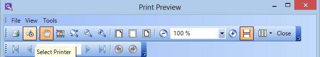
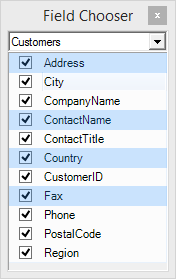

////

|metadata|
{
    "name": "whats-new-whats-new-in-2015-volume-1",
    "controlName": [],
    "tags": [],
    "guid": "f96d9c3b-053f-4489-81b8-66de536dd9e3",  
    "buildFlags": [],
    "createdOn": "2015-02-10T19:03:24.482821Z"
}
|metadata|
////

= What's New in 2015 Volume 1

== Topic Overview

=== Purpose

This topic presents the controls and the new and enhanced features for the Infragistics® Windows Forms 2015 Volume 1 release.

== What’s New Summary

=== What’s new summary chart

The following table summarizes what’s new in 2015 Volume 1. Additional details follow the summary table.

==== Animated Gif Support

[options="header", cols="a,a"]
|====
|Feature|Description

|<<AnimatedGifSupport,Animated Gif Support>>
|In addition to the pre-existing static image support, our Presentation Layer Framework (PLF) now has the ability to display animated images throughout our components.

|====

==== Word Engine

[options="header", cols="a,a"]
|====
|Feature|Description

|<<BulletandNumbering,Bullet and Numbering>>
|You can now add bullet lists and automatic numbering using the Infragistics WordDocumentWriter class in the 2015 Volume 1 release.

|====

==== New ISL Files

[options="header", cols="a,a"]
|====
|Feature|Description

|<<NewISLFiles,New ISL Files>>
|In the 2015 Volume 1 release we added many new ISL files.

|====

==== WinDockManager

[options="header", cols="a,a"]
|====
|Feature|Description

|<<CloseButtonsonTabs,Close Buttons on Tabs>>
|In previous versions, the close buttons for tabs were only available in the caption area of a pane. However in the 2015 Volume 1 release, the close button can also appear on the tab itself for any tabbed dock area.

|====

==== PrintDialog Button Tool

[options="header", cols="a,a"]
|====
|Feature|Description

|<<PrinterOptionsButton,PrintDialog Button>>
|This feature allows the users to optionally display a PrintDialog button tool to choose a printer or change other printer settings.

|====

==== WinGridColumnChooser

[options="header", cols="a,a"]
|====
|Feature|Description

|<<MultiSelect,Multi Select>>
|In the 2015 Volume 1 release a new feature which allows you to enable multiple row selection is added in the _WinGrid_™ ColumnChooser.

|====

== _Animated Gif Support_

[[AnimatedGifSupport]]

=== Animated Gif

In addition to the pre-existing static image support, our Presentation Layer Framework (PLF) now has the ability to display animated images throughout our components. A new AnimatedImageManager class has been added to the framework to automatically handle the rendering of images containing time-based frames.

==== Related topic:

* link:plf-animated-gif-support.html[Animated GIF Support]

== _Word Engine_

[[BulletandNumbering]]

=== Bullet and Numbering

This topic provides a conceptual overview of how to create bullet lists and automatic numbering runs in a wordprocessingML-compliant document using the Infragistics WordDocumentWriter class.

==== Related topic:

* link:word-using-bullet-lists-and-automatic-numbering.html[Using Bullet Lists and Automatic Numbering]

== _New ISL Files_

[[NewISLFiles]]

=== New ISL Files

There are three new ISL files available in this release. They are three Microsoft Visual Studio Themes:

* VS2013 - Blue.isl
* VS2013 - Dark.isl
* VS2013 - Light.isl

== _WinDockManager_

[[CloseButtonsonTabs]]

=== Close Buttons on Tabs

In previous versions, the close buttons for tabs were only available in the caption area of a pane. With the addition of the  _CloseButtonLocation_  property, the close button can also appear on the tab itself for any tabbed dock area.

The following screenshot is a preview of the close button appearing in the caption area, tabs of a tab group, and an unpinned tab.

image::images/Close_Button_On_Tabs_1.png[]

==== Related topic:

* link:windockmanager-close-buttons-on-tabs.html[Close Buttons on Tabs]

== _PrintPreviewDialog_

[[PrinterOptionsButton]]

=== Printer Options Button

The PrintDialog Button Tool allows you to modify printer settings including but not limited to choosing a printer, select the amount of copies per page, and setting a page range.

==== Related topic:

link:winprintpreviewdialog-adding-printdialog-button-tool.html[Adding PrintDialog Button Tool]

== _WinGridColumnChooser_

[[MultiSelect]]

=== Multi-select

A new property has been added to the UltraGridColumnChooser control, MultiSelect Enabled, which switches on multiple row selection, subsequently allowing the visibility or position of any number of columns to be changed in one atomic operation via user interaction.

The following screen shot shows the column chooser as it appears on the dialog that is displayed when a button in the grid is clicked and multiple rows are multi-selected:

==== Related topic:

* link:wingrid-enabling-multiple-row-selection.html[Enabling Multiple Row Selection]