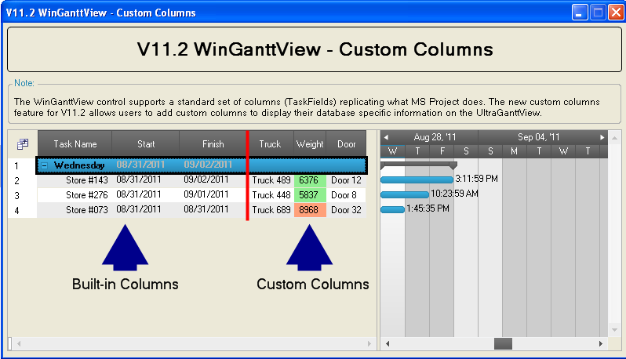

////

|metadata|
{
    "name": "whats-new-winganttview-custom-columns",
    "controlName": [],
    "tags": ["Application Scenarios","Grids"],
    "guid": "592523e8-9046-4134-8d40-d16eb0e63059",  
    "buildFlags": [],
    "createdOn": "2011-09-26T12:21:57.2112661Z"
}
|metadata|
////

= WinGanttView Custom Columns

Starting with 2011 Volume 2 of Infragistics Windows Forms, the WinGanttView™ control’s grid section allows the creation of custom columns to display custom data.

Figure 1: The WinGanttView showing a representation of the grid section containing custom columns

== Related Topics

* link:winganttview-custom-columns.html[Custom Columns]
* link:winganttview-databinding-support-for-winganttview.html[DataBinding Support for WinGanttView]
* link:winganttview-customize-grid-section-of-winganttview.html[Customize Grid Section of WinGanttView]