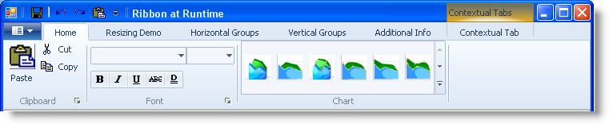

////

|metadata|
{
    "name": "whats-new-wintoolbarsmanager-new-scenic-ribbon-style",
    "controlName": [],
    "tags": [],
    "guid": "{3963ED8C-195C-4C46-83DF-3DF52E0A82B1}",  
    "buildFlags": [],
    "createdOn": "0001-01-01T00:00:00Z"
}
|metadata|
////

= WinToolBarsManager New Scenic Ribbon Style

With the release of Windows 7 operating system, Microsoft® has introduced a new Ribbon style- “Scenic Ribbon”. This release of Infragistics Windows Forms 2010 Vol1, includes support for the new ScenicRibbon style within our WinToolbarsManager™ component. With this addition, you can have your applications consistent with that of Windows 7 look and feel. The new style can be applied to the WinToolbarsManager component through the control’s  pick:[win-forms="link:{ApiPlatform}win.ultrawintoolbars{ApiVersion}~infragistics.win.ultrawintoolbars.ultratoolbarsmanager~style.html[Style]"]  property.

== Related Topics

* link:wintoolbarsmanager-scenic-ribbon-look-and-feel.html[Scenic Ribbon Look and Feel]