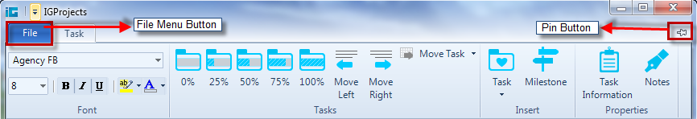

////

|metadata|
{
    "name": "whats-new-wintoolbarsmanager-office-2010-ribbon",
    "controlName": [],
    "tags": [],
    "guid": "dafd8b94-422e-4b63-8778-d820652ea9fa",  
    "buildFlags": [],
    "createdOn": "2010-09-20T14:23:38.8461299Z"
}
|metadata|
////

= WinToolbarsManager Office 2010 Ribbon

With the release of Office 2010, Microsoft® has introduced a new ribbon style. This release of Infragistics Windows Forms 2010 Volume 3 includes support for the new Office 2010 style Ribbon within our WinToolbarsManager component. A new link:{ApiPlatform}win{ApiVersion}~infragistics.win.office2010colortable.html[Office2010ColorTable] has been added to manage all the colors used in this style. A new Pin/Unpin button has been added to the top right corner of the Ribbon, which can be used to collapse/expand the Ribbon.

You can get this new look and feel for the Ribbon in your applications, by simply setting the Style property of WinToolbarsManager component to Office2010. The various parts of the Ribbon, such as the Ribbon Tabs (new extended glass in the Tab strip area), Quick Access Toolbar (QAT), Ribbon Groups, Contextual Tab Groups and the File Menu Button, will acquire the new Office 2010 style.

Also a new property called link:{ApiPlatform}win.ultrawintoolbars{ApiVersion}~infragistics.win.ultrawintoolbars.ribbon~filemenustyle.html[FileMenuStyle] has been added to the link:{ApiPlatform}win.ultrawintoolbars{ApiVersion}~infragistics.win.ultrawintoolbars.ribbon.html[Ribbon] object, which defines the type of menu (ApplicationMenu, ApplicationMenu2010, None) that drops down when the File Menu Button is clicked. A new application menu similar to Microsoft Office 2010 Backstage view can be obtained by setting the FileMenuStyle property to ApplicationMenu2010. This Office 2010 style application menu is comprised of Header, Navigation Menu and Content Area. For more information about Application Menu 2010, please see the Office 2010 Style Application Menu topic.

Related Topics

link:wintoolbarsmanager-office-2010-ribbon-look-and-feel.html[Office 2010 Ribbon Look and Feel]

link:wintoolbarsmanager-office-2010-style-application-menu.html[The Office 2010 style Application Menu]

link:styling-guide-office-2010-look-and-feel.html[Office 2010 Look and Feel]