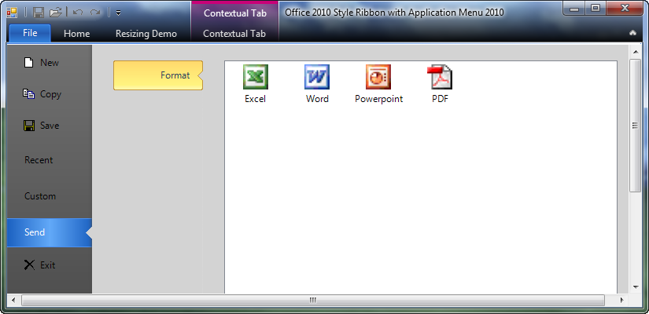

////

|metadata|
{
    "name": "whats-new-wintoolbarsmanager-wintoolbarsmanager-office-2010-style-application-menu",
    "controlName": [],
    "tags": [],
    "guid": "6b1e1e4c-9e66-4bf5-bf87-e8ad7c05f384",  
    "buildFlags": [],
    "createdOn": "2010-09-23T20:49:28.7253391Z"
}
|metadata|
////

= WinToolbarsManager Office 2010 Style Application Menu

With the release of Microsoft® Office 2010, the Ribbon has a new interface for the application menu. Starting with this release of Infragistics 2010 Volume 3, our WinToolbarsManger component includes support for this Office 2010 style application menu. A new link:{ApiPlatform}win.ultrawintoolbars{ApiVersion}~infragistics.win.ultrawintoolbars.ribbon~filemenustyle.html[FileMenuStyle] property has been added to the link:{ApiPlatform}win.ultrawintoolbars{ApiVersion}~infragistics.win.ultrawintoolbars.ribbon.html[Ribbon] object of the UltraToolbarsManager component, which determines the style of menu (ApplicationMenu, ApplicationMenu2010, None) that drops down when the menu button is clicked. When FileMenuStyle is set to ApplicationMenu2010, the new Office 2010 style menu will be shown in place of the standard application menu.

The left side of the Office 2010 application menu is the navigation menu (similar to ToolsAreaLeft of the standard application menu), which can display UltraToolbarsManager tools. The right side is the content area, where sub-items/Control that pops up from the navigation menu will be displayed.

Related Topics:

link:wintoolbarsmanager-office-2010-style-application-menu.html[Office 2010 Style Application Menu]

link:wintoolbarsmanager-add-tools-to-application-menu-2010.html[Add Tools to Application Menu 2010]

link:wintoolbarsmanager-customize-areas-of-application-menu-2010-and-file-menu-button.html[Customize Areas of Application Menu 2010 and File Menu Button]