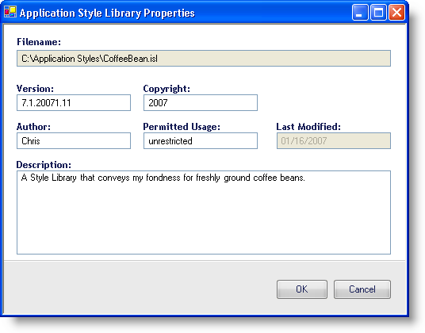

////

|metadata|
{
    "name": "win-add-your-personal-information-to-a-style-library-whats-new-20071",
    "controlName": [],
    "tags": [],
    "guid": "{50FEECDD-5C9D-42FD-841B-9E02DD5C1045}",  
    "buildFlags": [],
    "createdOn": "2006-11-12T15:05:31Z"
}
|metadata|
////

= Add Your Personal Information to a Style Library

Since the concept of Application Styling was introduced in 2006 Volume 1, several developers and graphic designers alike have been creating Style Libraries for use in several different scenarios. Several of these Style Libraries have been extremely creative and inventive. The desire to share these feats of creative prowess with the community is only natural.

Until now, there was no way to mark a Style Library as your own. We now provide the opportunity to fill in Style Library properties with your own personal information. Upon clicking the Style Library Properties... menu item in the File menu, an Application Style Library Properties dialog box will display. The information that you can add to the properties includes: File Version, Copyright, Author, Permitted Usage, and a general Description. The Style Library Properties also keeps track of the File Name and Last Modified date, though you can't modify these fields.

== Related Topics

link:styling-guide-personalizing-your-style-library.html[Personalizing Your Style Library]