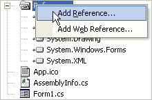

////

|metadata|
{
    "name": "win-adding-an-assembly-to-a-project",
    "controlName": [],
    "tags": ["FAQ","Getting Started"],
    "guid": "{ADDD829B-9E21-4E78-8BEA-CC06D0681866}",  
    "buildFlags": [],
    "createdOn": "2005-02-12T00:00:00Z"
}
|metadata|
////

= Adding an Assembly to a Project

Normally, manually adding assembly references to your project is not required, since Visual Studio is able to automatically add the appropriate references to the project as you place Infragistics tools onto the design surface. However, there will be times when you want or need to manually add a reference to an assembly to your project. Adding an assembly to your Visual Studio project is simple.

*Note:* For information on deploying Infragistics Windows Forms assemblies used in your application, see link:win-deploying-your-application.html[Deploying Your Application].

[start=1]
. Locate the References folder in the Visual Studio Solution Explorer.
[start=2]
. Right click on the References folder and select the Add Reference menu option to open the Add Reference dialog.

[start=3]
. Locate the assembly in the Add Reference dialog and click the Select button.
[start=4]
. Once you have selected the assembly, click the OK button to add the reference and close the dialog.

The Add Reference dialog allows you to select and add multiple references at the same time. To learn more about adding references to your project please see the following topics in the MSDN Library:

* link:http://msdn.microsoft.com/en-us/library/ez524kew(VS.80).aspx[Project References]
* link:http://msdn.microsoft.com/en-us/library/wkze6zky(VS.71).aspx[Adding and Removing References]
* link:http://msdn.microsoft.com/en-us/library/ftcwa60a(v=vs.90).aspx[Add Reference Dialog Box]