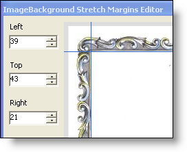

////

|metadata|
{
    "name": "win-appearance-object-nine-slice-scaling-whats-new-2006-1",
    "controlName": [],
    "tags": [],
    "guid": "{1D37B1C7-74DC-497D-A619-85847F712455}",  
    "buildFlags": [],
    "createdOn": "0001-01-01T00:00:00Z"
}
|metadata|
////

= Nine-Slice Scaling

Stretching images is a common occurrence in user interface design. Your own Windows desktop does it when your background image is too small and you have the Position set to Stretch. However, what happens when there is a border (acting as a picture frame) on the image? The border is stretched as well. This can make the border look quite grainy, especially if the border was a decorative one and not a solid color.

Now, with the new  pick:[win-forms="link:{ApiPlatform}win{ApiVersion}~infragistics.win.appearance~imagebackgroundstretchmargins.html[ImageBackgroundStretchMargins]"]  property that we added to the  pick:[win-forms="link:{ApiPlatform}win{ApiVersion}~infragistics.win.appearance.html[Appearance]"]  object of the link:win-plf-overview.html[Presentation Layer Framework™], you can identify the top, right, bottom, and left margins of an image, essentially identifying where the border ends and the actual image begins. This property breaks the image up into nine separate pieces. The corners remain the same and are never stretched. The top and bottom pieces of the middle column are only stretched horizontally and the right and left pieces of the middle row are only stretched vertically. Therefore, whatever margins you specify, the corners will never look stretched or grainy.

== Related Topics

link:win-change-an-images-stretch-margins-at-run-time.html[Change an Images's Stretch Margins at Run Time]