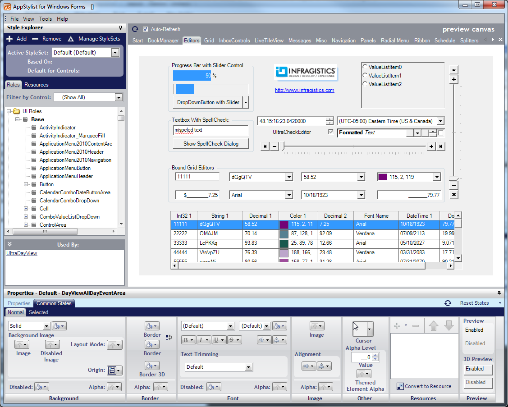

////

|metadata|
{
    "name": "win-application-styling-framework-whats-new-2006-2",
    "controlName": [],
    "tags": [],
    "guid": "{5AE48702-1570-472A-82A0-63D61A4A69E3}",  
    "buildFlags": [],
    "createdOn": "0001-01-01T00:00:00Z"
}
|metadata|
////

= Application Styling Framework

Application Styling is a ground-breaking concept in Windows Forms development that allows developers and graphic designers to collaborate more efficiently. The developer creates the application, while at the same time graphic designers create styles that can be used in that application. When finished, the graphic designer hands off the style library to the developer who then loads it into the application with only one line of code. Developing world-class applications with a stylish look and feel to go along with it has never been easier. Whether you're a one-person shop or an enterprise-level business, everyone can reap the benefits of Infragistics' link:styling-guide-application-styling-framework-asf.html[Application Styling Framework™] (ASF) – and the key to these benefits is in Infragistics' very own AppStylist®.

== AppStylist

AppStylist is a stand-alone application that runs outside of the Microsoft® Visual Studio® IDE. AppStylist lets you style every minute detail of your application with the help of our unique link:win-appearance-objects.html[Appearance] object and link:win-plf-overview.html[Presentation Layer Framework™]. You can even style in-box controls with the help of the InboxControlStyler™ component. Use the simple point-and-click interface and watch the styles change on the canvas. The user interface is divided into three intuitive sections:

* link:styling-guide-canvas.html[Canvas] – This section shows an example of your current style while dynamically updating whenever you change the style's settings.
* link:styling-guide-style-explorer.html[Style Explorer] – This section lets you select styles that you want to modify as well as change those styles based on the role they will play in either a user interface or as an individual component.
* link:styling-guide-properties-panel.html[Properties Panel] – This section is where you will spend most of your time changing the look and feel of different states.

== Even More Styling Options

AppStylist doesn't just come as a design-time application. You can also use AppStylist at run time with the AppStylistRuntime component. With the  pick:[win-forms="link:{ApiPlatform}win.appstylistsupport{ApiVersion}~infragistics.win.appstyling.runtime.appstylistruntime~showruntimeapplicationstylingeditor.html[ShowRuntimeApplicationStylingEditor]"]  method, you can launch a fully functional version of AppStylist integrated with your own application.

== Enhanced Support for Developers

Using styles in your application is even easier than creating the actual style itself. With the AppStylistSupport component, you simply need to  pick:[win-forms="link:{ApiPlatform}win{ApiVersion}~infragistics.win.appstyling.stylemanager~load.html[load]"]  a StyleLibrary. As a result, controls will pick up their default StyleSets or they will use a StyleSet targeted specifically for that control. You don't really have to set anything else to make it work. However, if you need the amount of precision you've come to expect from Infragistics' products, you can customize each control by setting its  pick:[win-forms="link:{ApiPlatform}win{ApiVersion}~infragistics.win.ultracontrolbase~stylesetname.html[StyleSetName]"]  property to a custom StyleSet. You can also find out if and when a StyleSet has been modified with the  pick:[win-forms="link:{ApiPlatform}win{ApiVersion}~infragistics.win.appstyling.stylemanager~stylechanged_ev.html[StyleChanged]"]  event.

== Related Topics

link:styling-guide-setting-up-your-application-for-styling.html[Setting Up Your Application for Styling]

link:styling-guide-styling-your-application.html[Styling Your Application]

link:win-inboxcontrolstyler.html[InboxControlStyler]

link:appstylistruntime.html[AppStylistRuntime]