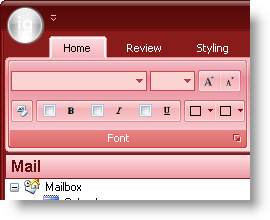

////

|metadata|
{
    "name": "win-blend-a-custom-color-with-office-2007-style-color-schemes",
    "controlName": [],
    "tags": ["Application Scenarios","How Do I","Styling","Theming"],
    "guid": "{EC9CB152-FF6D-46F4-8D46-91AFF1E769AD}",  
    "buildFlags": [],
    "createdOn": "0001-01-01T00:00:00Z"
}
|metadata|
////

= Blend a Custom Color with Office 2007-Style Color Schemes

In 2006 Volume 3, we released the entire Microsoft® Office 2007-Style look and feel. Arriving with this look and feel came three distinct color schemes: Blue, Black, and Silver. Being able to use only three colors, however, out of more than 65,000 is a little restricting. Therefore, in 2007 Volume 1, we're giving you the ability to blend any color with the three existing color schemes. Using the new  pick:[win-forms="link:{ApiPlatform}win{ApiVersion}~infragistics.win.office2007colortable~customblendcolor.html[CustomBlendColor]"]  property off the  pick:[win-forms="link:{ApiPlatform}win{ApiVersion}~infragistics.win.office2007colortable.html[Office2007ColorTable]"]  object, you can blend any system color with the Blue, Black, or Silver color schemes.

The following code will set the Office 2007 color scheme to Black and blend the Black scheme with the color Red.

.Note
[NOTE]
====
A control's view style must be set to Office 2007 in order to see these changes.
====

*In Visual Basic:*

----
Imports Infragistics.Win
...
Office2007ColorTable.ColorScheme = Office2007ColorScheme.Black
Office2007ColorTable.CustomBlendColor = Color.Red
----

*In C#:*

----
using Infragistics.Win;
...
Office2007ColorTable.ColorScheme = Office2007ColorScheme.Black;
Office2007ColorTable.CustomBlendColor = Color.Red;
----