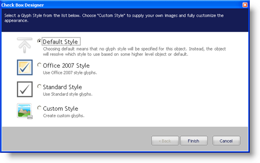
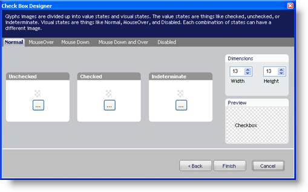

////

|metadata|
{
    "name": "win-new-designer-for-wincheckeditor-and-winoptionset",
    "controlName": [],
    "tags": [],
    "guid": "{CE858D34-EFB7-4A24-93DF-51440120B1E7}",  
    "buildFlags": [],
    "createdOn": "0001-01-01T00:00:00Z"
}
|metadata|
////

= New Designer for WinCheckEditor and WinOptionSet

Up until now, you were limited in the look and feel of both WinCheckEditor™ and WinOptionSet™. Although we recently released the new link:styling-guide-office-2007-look-and-feel.html[Microsoft® Office® 2007 style] for these two controls, you were never able to modify the look of these two controls to the level of using your own images. Using your own images for WinCheckBox and WinOptionSet would allow you to change the look to whatever your application requires, and the new WinCheckBox and WinOptionSet designers allow you to do this.

With the new designers, you'll be led through an intuitive, step-by-step process to set the controls' style. The styles you can choose from are the Office 2007 style, a standard style, and a custom style.

Setting a custom style allows you to select images for each state the control can be in.

== Related Topics

link:wincheckeditor-apply-the-office-2007-style-to-wincheckeditor.html[Apply the Office 2007 Style to WinCheckEditor]

link:winoptionset-apply-the-office-2007-style-to-winoptionset.html[Apply the Office 2007 Style to WinOptionSet]

link:wincheckeditor-creating-a-custom-style-for-wincheckeditor.html[Creating a Custom Style for WinCheckEditor]