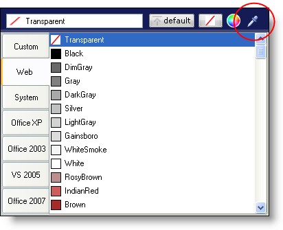

////

|metadata|
{
    "name": "win-new-eyedropper-whats-new-20063",
    "controlName": [],
    "tags": [],
    "guid": "{9130A940-A257-4053-A9CF-9F602081F760}",  
    "buildFlags": [],
    "createdOn": "0001-01-01T00:00:00Z"
}
|metadata|
////

= New Eyedropper

== Grab a Color from Anywhere on the Screen with the New Eyedropper

The new eye drop element in the color picker button allows you to capture any color that appears on the screen. All you need to do is click in the eye dropper area and drag the eye dropper over the screen. Once you've confirmed the color you want to capture, release the mouse button and that color will be applied to the current role.

== Related Topics

link:styling-guide-background-pane.html[Background Pane]