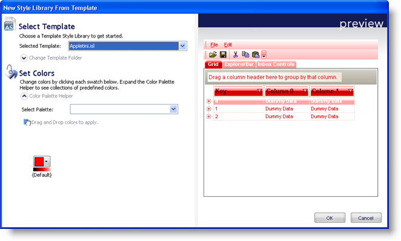
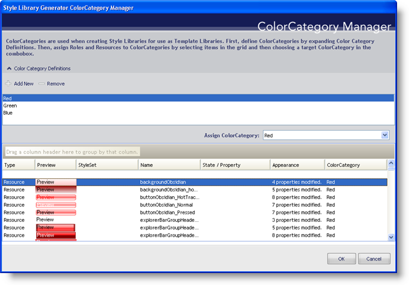

////

|metadata|
{
    "name": "win-new-isl-generator-whats-new-20071",
    "controlName": [],
    "tags": [],
    "guid": "{F30302D1-6866-45CC-8B9D-FA6BB865274B}",  
    "buildFlags": [],
    "createdOn": "2006-11-12T15:06:37Z"
}
|metadata|
////

= New ISL Generator

Styling every single UI Role in a StyleSet is admittedly a long and arduous task, even though the concept of a completely customized style is rewarding. Infragistics would like to assist in this area by offering Style Library Templates that will automatically generate complete StyleSets at the click of a button.

Creating a themed Style Library based off a template is as easy as choosing a color. By clicking the New Style Library from Template... menu item off the New Style Library... flyout menu, the New Style Library From Template dialog box appears. Once you've selected a template Style Library to modify, you can match colors with ColorCategories for a unique style. Clicking the Generate button will automatically create the entire Style Library for you.

Creating a Style Library Template for use in generating a themed Style Library can also save you a great deal of time as well as give you the ability to customize colors for several different roles. It is possible to use a regular Style Library as a template, but you can also customize the colors of the Resources in a Style Library as well. The Style Library Generator ColorCategory Manager dialog box allows you to generate ColorCategories, which you can then assign to Resources or specific UI Roles. Once these ColorCategories are created, you can assign colors to them in the Generate Style Library dialog box. The possible combinations are truly limitless.

== Related Topics

link:styling-guide-the-style-library-generator-colorcategory-manager-dialog-box.html[The Style Library Generator ColorCategory Manager Dialog Box]

link:styling-guide-creating-a-style-library-from-a-template.html[Creating a Style Library from a Template]