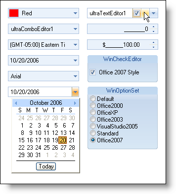

////

|metadata|
{
    "name": "win-new-look-and-feel-for-wineditors-whats-new-20063",
    "controlName": [],
    "tags": [],
    "guid": "{4EF0DA4D-66B0-42A8-AD77-9A997197FEDB}",  
    "buildFlags": [],
    "createdOn": "0001-01-01T00:00:00Z"
}
|metadata|
////

= New Look and Feel for WinEditors

Each of our editors has gained the new Microsoft® Office 2007 look and feel. By changing the pre-existing DisplayStyle property to Office2007, you've done all you need to do in order for an editor to take on the new look and feel. Editor buttons also have the ability to display the Office 2007 look and feel.

== Related Topics

link:styling-guide-office-2007-look-and-feel.html[Office 2007 Look and Feel]

link:wincheckeditor-apply-the-office-2007-style-to-wincheckeditor.html[Apply the Office 2007 Style to WinCheckEditor]

link:winoptionset-apply-the-office-2007-style-to-winoptionset.html[Apply the Office 2007 Style to WinOptionSet]