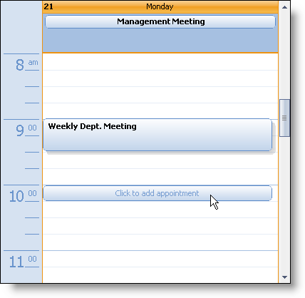
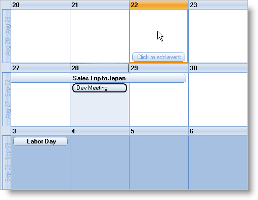
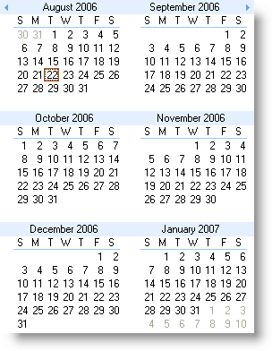
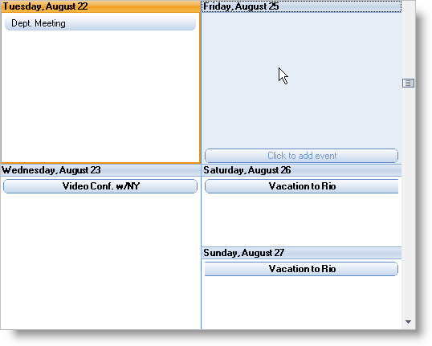

////

|metadata|
{
    "name": "win-new-look-and-feel-for-winschedule-whats-new-20063",
    "controlName": [],
    "tags": [],
    "guid": "{FC23BBE4-F537-49AA-A626-2AC7DB1D6599}",  
    "buildFlags": [],
    "createdOn": "0001-01-01T00:00:00Z"
}
|metadata|
////

= New Look and Feel for WinSchedule

Microsoft® Office 2007 has a completely brand new look and feel. Microsoft Outlook 2007 is no exception. The entire user interface was redesigned for a cleaner look. We took these new styles and applied them to our own WinSchedule controls and components for a UI experience that you won't soon forget. The color scheme of calendar items and owners has been changed to a pleasant pastel look.

The "Click to Add" feature is an easy way to quickly add appointments to your calendar. Just hover over a time-slot in Day view or a day in Month or Week view and an indicator will display asking if you'd like to add an appointment.

Microsoft no longer has a week view in their Office 2007 product, however, we still do! Current users and fans of WinWeekView need not worry, we covered all our bases. We extrapolated colors and schemes to give applications equipped with WinWeekView an up-to-date look and feel.

== Related Topics

link:winschedule-use-the-click-to-add-indicator.html[Use the Click to Add Indicator]

link:winschedule-working-with-the-outlook-2007-color-scheme.html[Working with the Outlook 2007 Color Scheme]