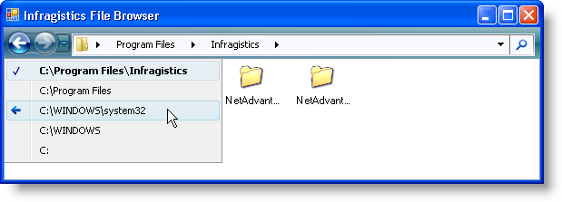
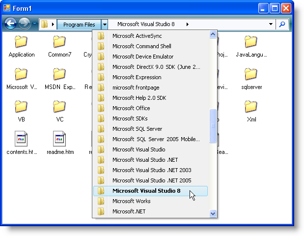
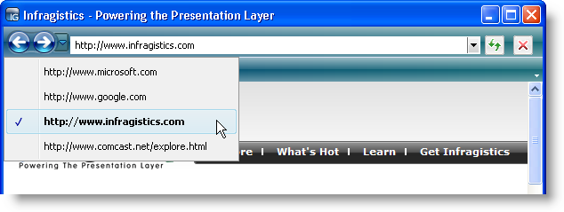

////

|metadata|
{
    "name": "win-new-navigation-toolbar-whats-new-20073",
    "controlName": [],
    "tags": [],
    "guid": "{EF054047-91A1-4FB0-B31C-9CD8DC920BA7}",  
    "buildFlags": [],
    "createdOn": "0001-01-01T00:00:00Z"
}
|metadata|
////

= New Navigation Toolbar

The Navigation toolbar is the latest addition to the WinToolbarsManager™ family of toolbars. The Navigation toolbar enables you to navigate through any collection of items. Whether the collection is a simple array of strings or a complex file system, the Navigation toolbar does all the navigation for you – all you need to do is write the code that performs the action when navigating.

When you navigate to an item, the Navigation toolbar automatically adds the item and an optional attached object to its own internal history. When you click on the back or forward buttons, the  pick:[win-forms="link:{ApiPlatform}win.ultrawintoolbars{ApiVersion}~infragistics.win.ultrawintoolbars.ultratoolbarsmanager~afternavigation_ev.html[AfterNavigation]"]  event fires and implements your custom navigation code, such as browsing to a Web site or folder.

== Navigating in Familiar Surroundings

Nobody enjoys driving their car into a strange neighborhood, only to realize that they’re lost! That’s why we've modeled the Navigation toolbar off of the popular Windows® Vista™ Windows Explorer and Microsoft® Internet Explorer® 7 – so your end user already knows where they’re going. The fact that we've used these familiar UI themes will give your end user a clue of what to expect. The back and forward buttons, however, don’t represent a new paradigm recently developed. This type of navigation has proven itself in past user interfaces (especially internet browsers) and your end users will benefit from that experience.

== File and Internet Browsing

When used side-by-side (quite literally!) with the WinNavigationBar control, also new this release, you can design a fully functioning file system browser that rivals Microsoft’s own Windows Explorer.

Alternatively, you can place a link:wintoolbarsmanager-combobox-about-the-combobox-tool.html[ComboBox] tool and a few link:wintoolbarsmanager-button-about-the-button-tool.html[Button] tools on the Navigation toolbar for an internet browsing experience similar to Internet Explorer 7.

== Related Topics

link:wintoolbarsmanager-navigation-toolbar-about-the-navigation-toolbar.html[About the Navigation Toolbar]

link:wintoolbarsmanager-using-the-navigation-toolbar.html[Using the Navigation Toolbar]