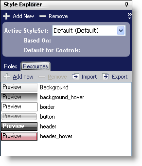
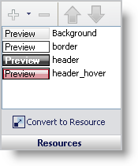

////

|metadata|
{
    "name": "win-new-resource-previews-whats-new-20063",
    "controlName": [],
    "tags": [],
    "guid": "{8E33F269-A264-439E-9045-C6FE711EF9B6}",  
    "buildFlags": [],
    "createdOn": "0001-01-01T00:00:00Z"
}
|metadata|
////

= New Resource Previews

== You Can Now Preview Resources in Multiple Areas

Previously, if you wanted to preview a resource, the Preview pane needed to be turned on. Now, we give you a glimpse of resources both in the Resources tab of the Style Explorer and the Resources pane in the UI Role Editor.

== Related Topics

link:styling-guide-resources.html[Resources]

link:styling-guide-resources-pane.html[Resources Pane]